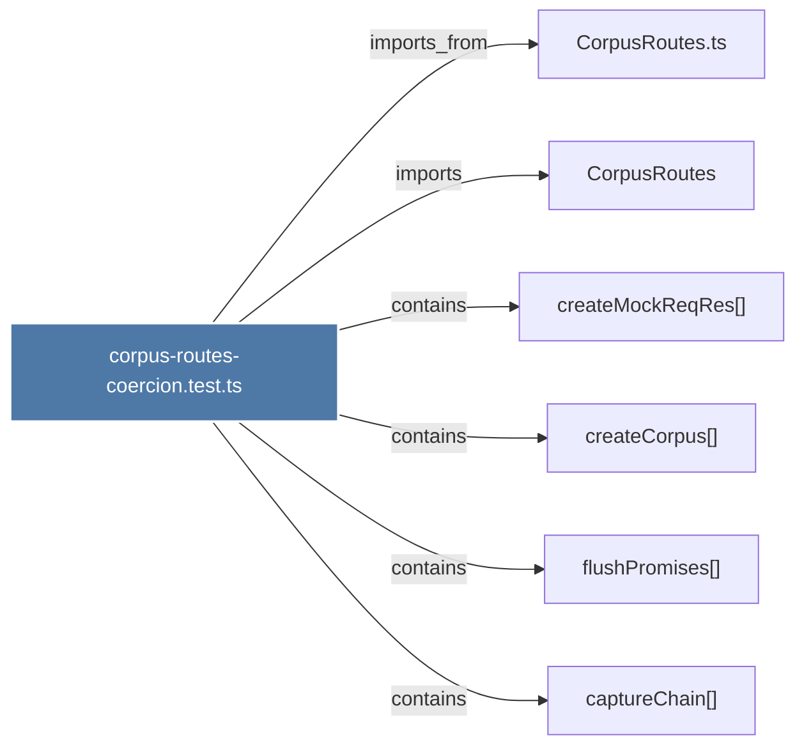

# corpus-routes-coercion.test.ts

> [!info] Properties
> **File Type**: code
> **Community**: [[_COMMUNITY_Community None|Community None]]
> **Degree**: 6

## Architecture Graph


## Outbound Connections
- [[CorpusRoutes]] - `imports` [EXTRACTED]
- [[CorpusRoutes.ts]] - `imports_from` [EXTRACTED]
- [[captureChain()_2]] - `contains` [EXTRACTED]
- [[createCorpus()]] - `contains` [EXTRACTED]
- [[createMockReqRes()_2]] - `contains` [EXTRACTED]
- [[flushPromises()]] - `contains` [EXTRACTED]

## Inbound Dependencies
> [!abstract]- Files that link here
```dataview
LIST
FROM [[corpus-routes-coercion.test.ts]]
```

#graphify/code #graphify/EXTRACTED #community/Community_None