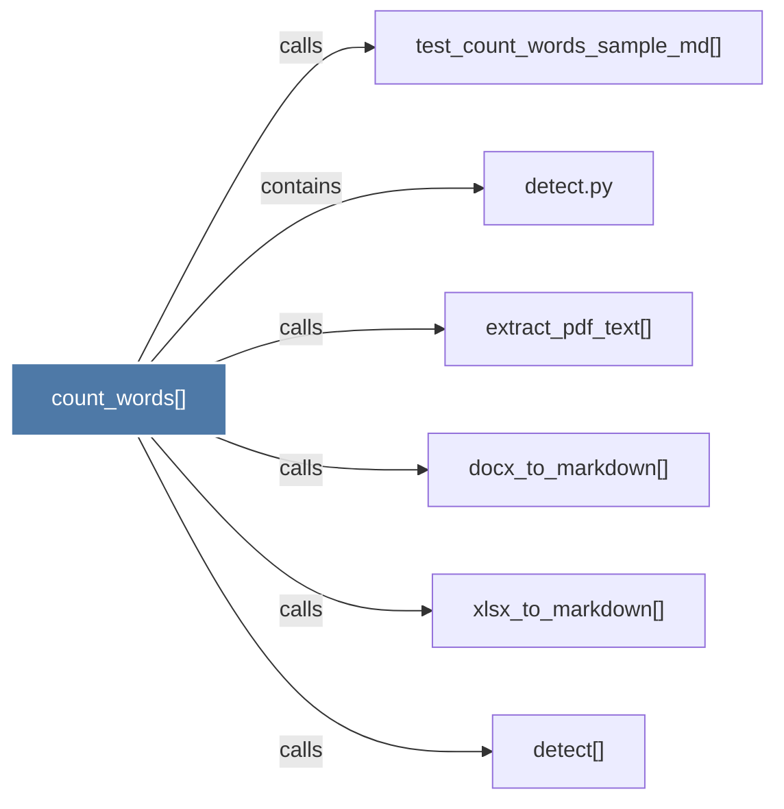

# count_words()

> [!info] Properties
> **File Type**: code
> **Community**: [[_COMMUNITY_Community None|Community None]]
> **Degree**: 6

## Architecture Graph


## Outbound Connections
- [[detect()]] - `calls` [EXTRACTED]
- [[detect.py]] - `contains` [EXTRACTED]
- [[docx_to_markdown()]] - `calls` [EXTRACTED]
- [[extract_pdf_text()]] - `calls` [EXTRACTED]
- [[test_count_words_sample_md()]] - `calls` [INFERRED]
- [[xlsx_to_markdown()]] - `calls` [EXTRACTED]

## Inbound Dependencies
> [!abstract]- Files that link here
```dataview
LIST
FROM [[count_words()]]
```

#graphify/code #graphify/EXTRACTED #community/Community_None