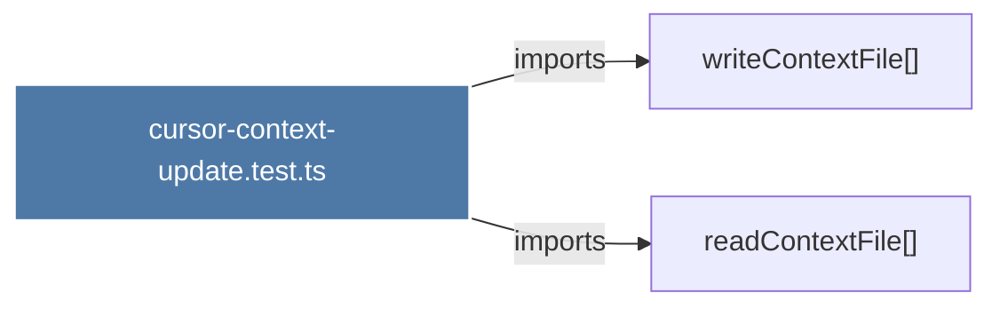

# cursor-context-update.test.ts

> [!info] Properties
> **File Type**: code
> **Community**: [[_COMMUNITY_Community None|Community None]]
> **Degree**: 2

## Architecture Graph


## Outbound Connections
- [[readContextFile()]] - `imports` [EXTRACTED]
- [[writeContextFile()]] - `imports` [EXTRACTED]

## Inbound Dependencies
> [!abstract]- Files that link here
```dataview
LIST
FROM [[cursor-context-update.test.ts]]
```

#graphify/code #graphify/EXTRACTED #community/Community_None