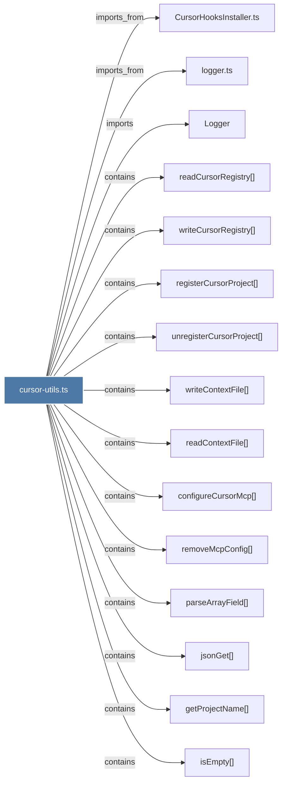

# cursor-utils.ts

> [!info] Properties
> **File Type**: code
> **Community**: [[_COMMUNITY_Community None|Community None]]
> **Degree**: 16

## Architecture Graph


## Outbound Connections
- [[CursorHooksInstaller.ts]] - `imports_from` [EXTRACTED]
- [[Logger]] - `imports` [EXTRACTED]
- [[configureCursorMcp()_1]] - `contains` [EXTRACTED]
- [[getProjectName()_1]] - `contains` [EXTRACTED]
- [[isEmpty()]] - `contains` [EXTRACTED]
- [[jsonGet()]] - `contains` [EXTRACTED]
- [[logger.ts]] - `imports_from` [EXTRACTED]
- [[parseArrayField()]] - `contains` [EXTRACTED]
- [[readContextFile()]] - `contains` [EXTRACTED]
- [[readCursorRegistry()_1]] - `contains` [EXTRACTED]
- [[registerCursorProject()_1]] - `contains` [EXTRACTED]
- [[removeMcpConfig()]] - `contains` [EXTRACTED]
- [[unregisterCursorProject()_1]] - `contains` [EXTRACTED]
- [[urlEncode()]] - `contains` [EXTRACTED]
- [[writeContextFile()]] - `contains` [EXTRACTED]
- [[writeCursorRegistry()_1]] - `contains` [EXTRACTED]

## Inbound Dependencies
> [!abstract]- Files that link here
```dataview
LIST
FROM [[cursor-utils.ts]]
```

#graphify/code #graphify/EXTRACTED #community/Community_None