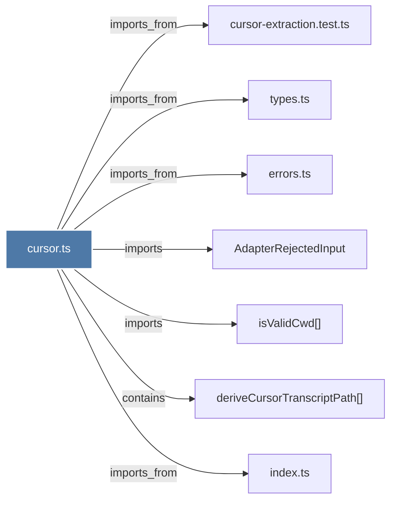

# cursor.ts

> [!info] Properties
> **File Type**: code
> **Community**: [[_COMMUNITY_Community None|Community None]]
> **Degree**: 7

## Architecture Graph


## Outbound Connections
- [[AdapterRejectedInput]] - `imports` [EXTRACTED]
- [[cursor-extraction.test.ts]] - `imports_from` [EXTRACTED]
- [[deriveCursorTranscriptPath()]] - `contains` [EXTRACTED]
- [[errors.ts]] - `imports_from` [EXTRACTED]
- [[index.ts_1]] - `imports_from` [EXTRACTED]
- [[isValidCwd()]] - `imports` [EXTRACTED]
- [[types.ts]] - `imports_from` [EXTRACTED]

## Inbound Dependencies
> [!abstract]- Files that link here
```dataview
LIST
FROM [[cursor.ts]]
```

#graphify/code #graphify/EXTRACTED #community/Community_None