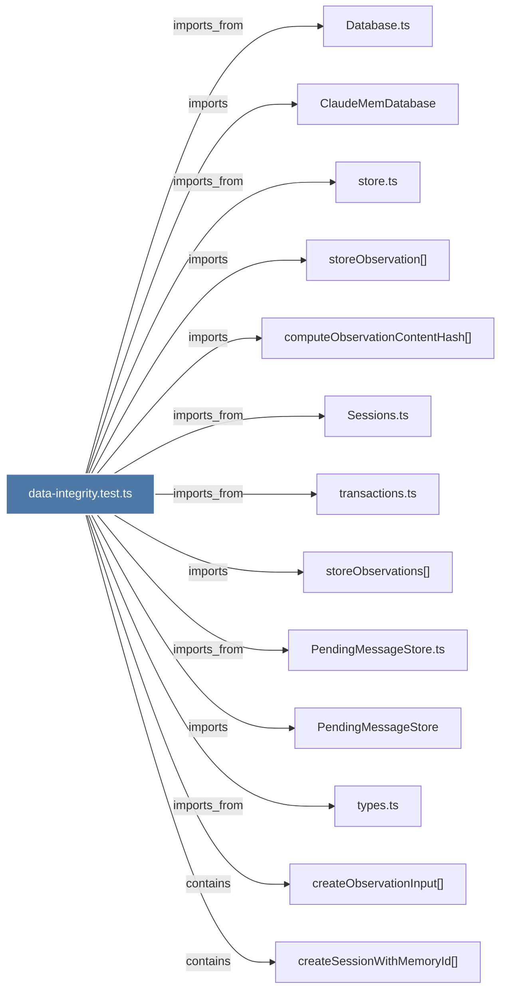

# data-integrity.test.ts

> [!info] Properties
> **File Type**: code
> **Community**: [[_COMMUNITY_Community None|Community None]]
> **Degree**: 13

## Architecture Graph


## Outbound Connections
- [[ClaudeMemDatabase]] - `imports` [EXTRACTED]
- [[Database.ts]] - `imports_from` [EXTRACTED]
- [[PendingMessageStore]] - `imports` [EXTRACTED]
- [[PendingMessageStore.ts]] - `imports_from` [EXTRACTED]
- [[Sessions.ts]] - `imports_from` [EXTRACTED]
- [[computeObservationContentHash()]] - `imports` [EXTRACTED]
- [[createObservationInput()_1]] - `contains` [EXTRACTED]
- [[createSessionWithMemoryId()_1]] - `contains` [EXTRACTED]
- [[store.ts]] - `imports_from` [EXTRACTED]
- [[storeObservation()]] - `imports` [EXTRACTED]
- [[storeObservations()]] - `imports` [EXTRACTED]
- [[transactions.ts]] - `imports_from` [EXTRACTED]
- [[types.ts_7]] - `imports_from` [EXTRACTED]

## Inbound Dependencies
> [!abstract]- Files that link here
```dataview
LIST
FROM [[data-integrity.test.ts]]
```

#graphify/code #graphify/EXTRACTED #community/Community_None