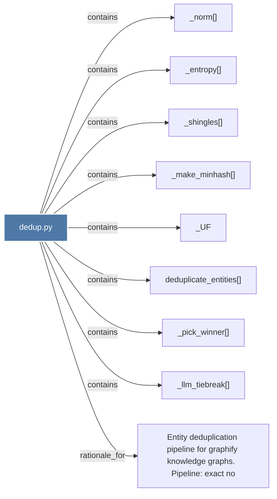

# dedup.py

> [!info] Properties
> **File Type**: code
> **Community**: [[_COMMUNITY_Community None|Community None]]
> **Degree**: 9

## Architecture Graph


## Outbound Connections
- [[Entity deduplication pipeline for graphify knowledge graphs.  Pipeline exact no]] - `rationale_for` [EXTRACTED]
- [[_UF]] - `contains` [EXTRACTED]
- [[_entropy()]] - `contains` [EXTRACTED]
- [[_llm_tiebreak()]] - `contains` [EXTRACTED]
- [[_make_minhash()]] - `contains` [EXTRACTED]
- [[_norm()]] - `contains` [EXTRACTED]
- [[_pick_winner()]] - `contains` [EXTRACTED]
- [[_shingles()]] - `contains` [EXTRACTED]
- [[deduplicate_entities()]] - `contains` [EXTRACTED]

## Inbound Dependencies
> [!abstract]- Files that link here
```dataview
LIST
FROM [[dedup.py]]
```

#graphify/code #graphify/EXTRACTED #community/Community_None