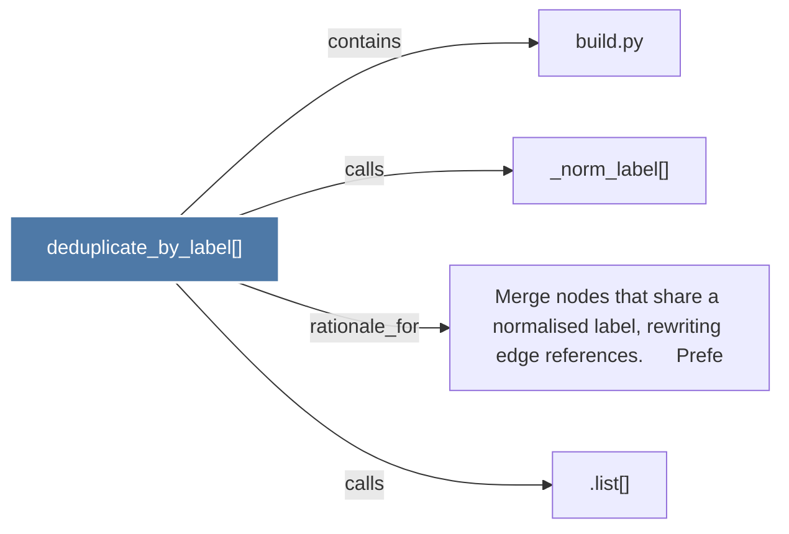

# deduplicate_by_label()

> [!info] Properties
> **File Type**: code
> **Community**: [[_COMMUNITY_Community None|Community None]]
> **Degree**: 4

## Architecture Graph


## Outbound Connections
- [[.list()]] - `calls` [INFERRED]
- [[Merge nodes that share a normalised label, rewriting edge references.      Prefe]] - `rationale_for` [EXTRACTED]
- [[_norm_label()]] - `calls` [EXTRACTED]
- [[build.py]] - `contains` [EXTRACTED]

## Inbound Dependencies
> [!abstract]- Files that link here
```dataview
LIST
FROM [[deduplicate_by_label()]]
```

#graphify/code #graphify/EXTRACTED #community/Community_None