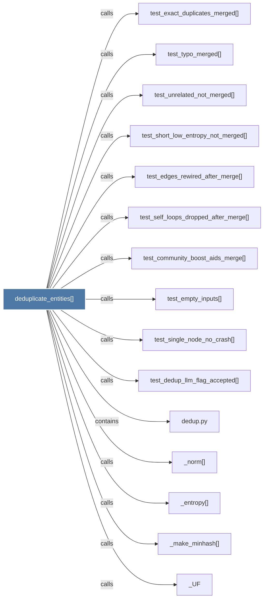

# deduplicate_entities()

> [!info] Properties
> **File Type**: code
> **Community**: [[_COMMUNITY_Community None|Community None]]
> **Degree**: 23

## Architecture Graph


## Outbound Connections
- [[.components()]] - `calls` [EXTRACTED]
- [[.find()]] - `calls` [EXTRACTED]
- [[.list()]] - `calls` [INFERRED]
- [[.union()]] - `calls` [EXTRACTED]
- [[Deduplicate near-identical entities in a knowledge graph.      Args         nod]] - `rationale_for` [EXTRACTED]
- [[_UF]] - `calls` [EXTRACTED]
- [[_entropy()]] - `calls` [EXTRACTED]
- [[_llm_tiebreak()]] - `calls` [EXTRACTED]
- [[_make_minhash()]] - `calls` [EXTRACTED]
- [[_norm()]] - `calls` [EXTRACTED]
- [[_pick_winner()]] - `calls` [EXTRACTED]
- [[build()]] - `calls` [INFERRED]
- [[dedup.py]] - `contains` [EXTRACTED]
- [[test_community_boost_aids_merge()]] - `calls` [INFERRED]
- [[test_dedup_llm_flag_accepted()]] - `calls` [INFERRED]
- [[test_edges_rewired_after_merge()]] - `calls` [INFERRED]
- [[test_empty_inputs()]] - `calls` [INFERRED]
- [[test_exact_duplicates_merged()]] - `calls` [INFERRED]
- [[test_self_loops_dropped_after_merge()]] - `calls` [INFERRED]
- [[test_short_low_entropy_not_merged()]] - `calls` [INFERRED]
- [[test_single_node_no_crash()]] - `calls` [INFERRED]
- [[test_typo_merged()]] - `calls` [INFERRED]
- [[test_unrelated_not_merged()]] - `calls` [INFERRED]

## Inbound Dependencies
> [!abstract]- Files that link here
```dataview
LIST
FROM [[deduplicate_entities()]]
```

#graphify/code #graphify/INFERRED #community/Community_None