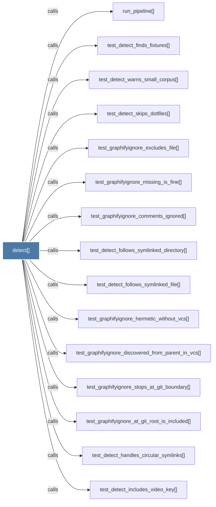

# detect()

> [!info] Properties
> **File Type**: code
> **Community**: [[_COMMUNITY_Community None|Community None]]
> **Degree**: 31

## Architecture Graph


## Outbound Connections
- [[_could_contain_included_path()]] - `calls` [EXTRACTED]
- [[_is_ignored()]] - `calls` [EXTRACTED]
- [[_is_included()]] - `calls` [EXTRACTED]
- [[_is_noise_dir()]] - `calls` [EXTRACTED]
- [[_is_sensitive()]] - `calls` [EXTRACTED]
- [[_load_graphifyignore()]] - `calls` [EXTRACTED]
- [[_load_graphifyinclude()]] - `calls` [EXTRACTED]
- [[_rebuild_code()]] - `calls` [INFERRED]
- [[classify_file()]] - `calls` [EXTRACTED]
- [[convert_office_file()]] - `calls` [EXTRACTED]
- [[count_words()]] - `calls` [EXTRACTED]
- [[detect.py]] - `contains` [EXTRACTED]
- [[detect_incremental()]] - `calls` [EXTRACTED]
- [[run_pipeline()]] - `calls` [INFERRED]
- [[str]] - `calls` [EXTRACTED]
- [[test_detect_finds_fixtures()]] - `calls` [INFERRED]
- [[test_detect_finds_video_files()]] - `calls` [INFERRED]
- [[test_detect_follows_symlinked_directory()]] - `calls` [INFERRED]
- [[test_detect_follows_symlinked_file()]] - `calls` [INFERRED]
- [[test_detect_handles_circular_symlinks()]] - `calls` [INFERRED]
- [[test_detect_includes_video_key()]] - `calls` [INFERRED]
- [[test_detect_skips_dotfiles()]] - `calls` [INFERRED]
- [[test_detect_video_not_in_words()]] - `calls` [INFERRED]
- [[test_detect_warns_small_corpus()]] - `calls` [INFERRED]
- [[test_graphifyignore_at_git_root_is_included()]] - `calls` [INFERRED]
- [[test_graphifyignore_comments_ignored()]] - `calls` [INFERRED]
- [[test_graphifyignore_discovered_from_parent_in_vcs()]] - `calls` [INFERRED]
- [[test_graphifyignore_excludes_file()]] - `calls` [INFERRED]
- [[test_graphifyignore_hermetic_without_vcs()]] - `calls` [INFERRED]
- [[test_graphifyignore_missing_is_fine()]] - `calls` [INFERRED]
- [[test_graphifyignore_stops_at_git_boundary()]] - `calls` [INFERRED]

## Inbound Dependencies
> [!abstract]- Files that link here
```dataview
LIST
FROM [[detect()]]
```

#graphify/code #graphify/INFERRED #community/Community_None