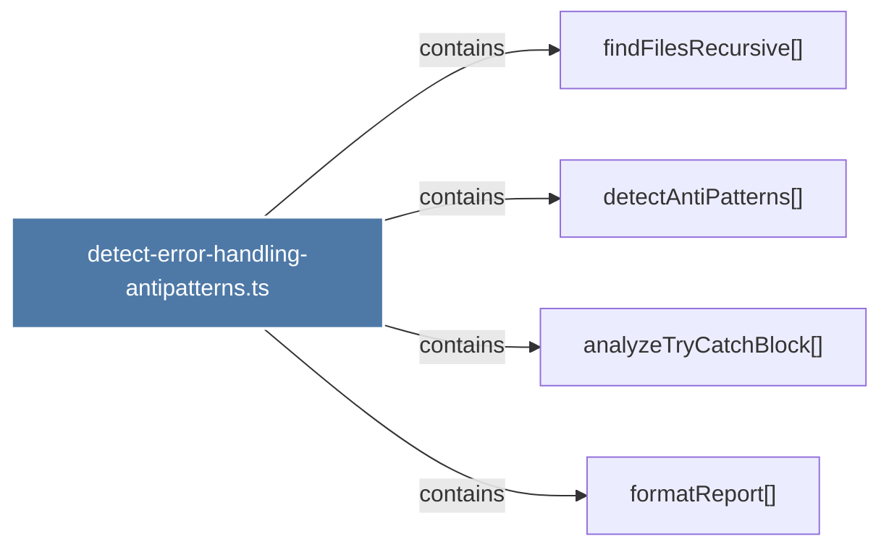

# detect-error-handling-antipatterns.ts

> [!info] Properties
> **File Type**: code
> **Community**: [[_COMMUNITY_Community None|Community None]]
> **Degree**: 4

## Architecture Graph


## Outbound Connections
- [[analyzeTryCatchBlock()]] - `contains` [EXTRACTED]
- [[detectAntiPatterns()]] - `contains` [EXTRACTED]
- [[findFilesRecursive()]] - `contains` [EXTRACTED]
- [[formatReport()]] - `contains` [EXTRACTED]

## Inbound Dependencies
> [!abstract]- Files that link here
```dataview
LIST
FROM [[detect-error-handling-antipatterns.ts]]
```

#graphify/code #graphify/EXTRACTED #community/Community_None