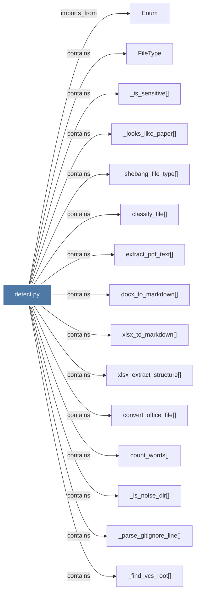

# detect.py

> [!info] Properties
> **File Type**: code
> **Community**: [[_COMMUNITY_Community None|Community None]]
> **Degree**: 25

## Architecture Graph


## Outbound Connections
- [[Enum]] - `imports_from` [EXTRACTED]
- [[FileType]] - `contains` [EXTRACTED]
- [[_could_contain_included_path()]] - `contains` [EXTRACTED]
- [[_find_vcs_root()]] - `contains` [EXTRACTED]
- [[_is_ignored()]] - `contains` [EXTRACTED]
- [[_is_included()]] - `contains` [EXTRACTED]
- [[_is_noise_dir()]] - `contains` [EXTRACTED]
- [[_is_sensitive()]] - `contains` [EXTRACTED]
- [[_load_graphifyignore()]] - `contains` [EXTRACTED]
- [[_load_graphifyinclude()]] - `contains` [EXTRACTED]
- [[_looks_like_paper()]] - `contains` [EXTRACTED]
- [[_md5_file()]] - `contains` [EXTRACTED]
- [[_parse_gitignore_line()]] - `contains` [EXTRACTED]
- [[_shebang_file_type()]] - `contains` [EXTRACTED]
- [[classify_file()]] - `contains` [EXTRACTED]
- [[convert_office_file()]] - `contains` [EXTRACTED]
- [[count_words()]] - `contains` [EXTRACTED]
- [[detect()]] - `contains` [EXTRACTED]
- [[detect_incremental()]] - `contains` [EXTRACTED]
- [[docx_to_markdown()]] - `contains` [EXTRACTED]
- [[extract_pdf_text()]] - `contains` [EXTRACTED]
- [[load_manifest()]] - `contains` [EXTRACTED]
- [[save_manifest()]] - `contains` [EXTRACTED]
- [[xlsx_extract_structure()]] - `contains` [EXTRACTED]
- [[xlsx_to_markdown()]] - `contains` [EXTRACTED]

## Inbound Dependencies
> [!abstract]- Files that link here
```dataview
LIST
FROM [[detect.py]]
```

#graphify/code #graphify/EXTRACTED #community/Community_None