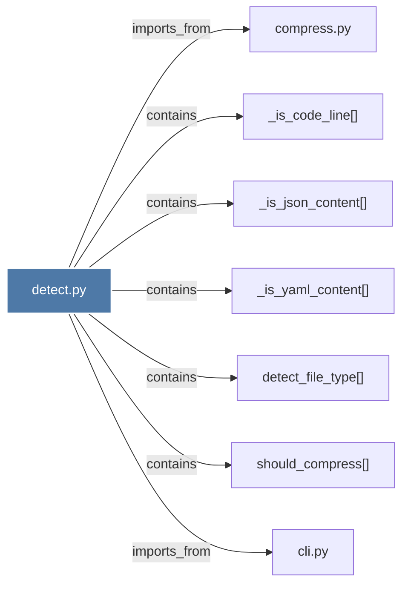

# detect.py

> [!info] Properties
> **File Type**: code
> **Community**: [[_COMMUNITY_Community None|Community None]]
> **Degree**: 7

## Architecture Graph


## Outbound Connections
- [[_is_code_line()]] - `contains` [EXTRACTED]
- [[_is_json_content()]] - `contains` [EXTRACTED]
- [[_is_yaml_content()]] - `contains` [EXTRACTED]
- [[cli.py]] - `imports_from` [EXTRACTED]
- [[compress.py]] - `imports_from` [EXTRACTED]
- [[detect_file_type()]] - `contains` [EXTRACTED]
- [[should_compress()]] - `contains` [EXTRACTED]

## Inbound Dependencies
> [!abstract]- Files that link here
```dataview
LIST
FROM [[detect.py_1]]
```

#graphify/code #graphify/EXTRACTED #community/Community_None