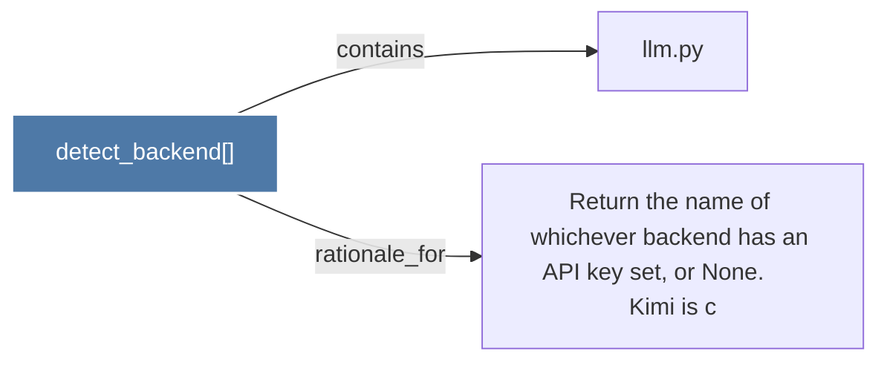

# detect_backend()

> [!info] Properties
> **File Type**: code
> **Community**: [[_COMMUNITY_Community None|Community None]]
> **Degree**: 2

## Architecture Graph


## Outbound Connections
- [[Return the name of whichever backend has an API key set, or None.      Kimi is c]] - `rationale_for` [EXTRACTED]
- [[llm.py]] - `contains` [EXTRACTED]

## Inbound Dependencies
> [!abstract]- Files that link here
```dataview
LIST
FROM [[detect_backend()]]
```

#graphify/code #graphify/EXTRACTED #community/Community_None