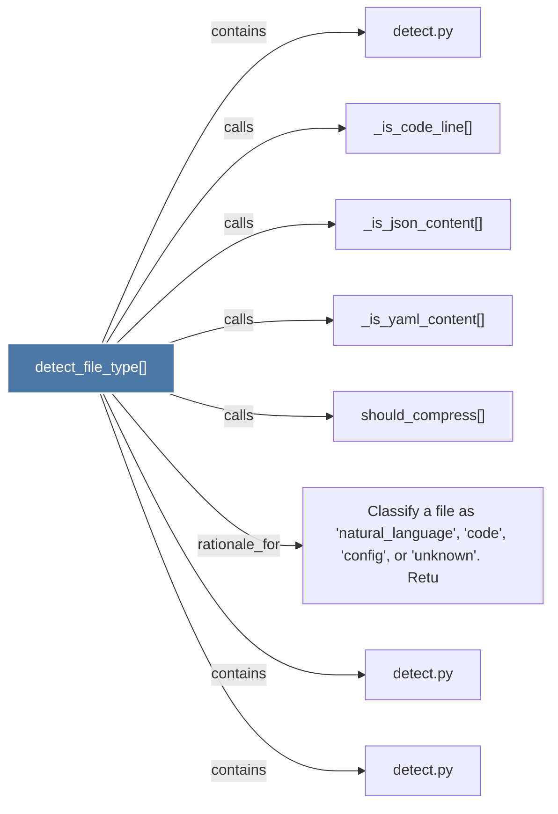

# detect_file_type()

> [!info] Properties
> **File Type**: code
> **Community**: [[_COMMUNITY_Community None|Community None]]
> **Degree**: 8

## Architecture Graph


## Outbound Connections
- [[Classify a file as 'natural_language', 'code', 'config', or 'unknown'.      Retu]] - `rationale_for` [EXTRACTED]
- [[_is_code_line()]] - `calls` [EXTRACTED]
- [[_is_json_content()]] - `calls` [EXTRACTED]
- [[_is_yaml_content()]] - `calls` [EXTRACTED]
- [[detect.py_1]] - `contains` [EXTRACTED]
- [[detect.py_2]] - `contains` [EXTRACTED]
- [[detect.py_3]] - `contains` [EXTRACTED]
- [[should_compress()]] - `calls` [EXTRACTED]

## Inbound Dependencies
> [!abstract]- Files that link here
```dataview
LIST
FROM [[detect_file_type()]]
```

#graphify/code #graphify/EXTRACTED #community/Community_None