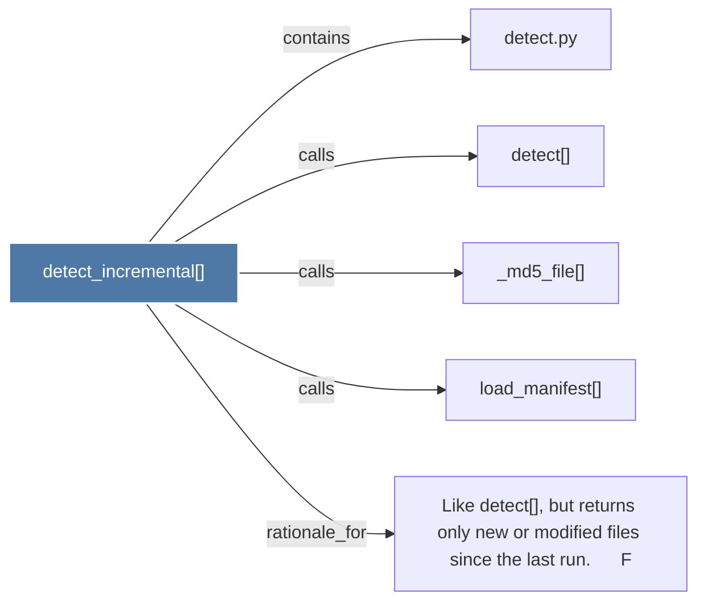

# detect_incremental()

> [!info] Properties
> **File Type**: code
> **Community**: [[_COMMUNITY_Community None|Community None]]
> **Degree**: 5

## Architecture Graph


## Outbound Connections
- [[Like detect(), but returns only new or modified files since the last run.      F]] - `rationale_for` [EXTRACTED]
- [[_md5_file()]] - `calls` [EXTRACTED]
- [[detect()]] - `calls` [EXTRACTED]
- [[detect.py]] - `contains` [EXTRACTED]
- [[load_manifest()]] - `calls` [EXTRACTED]

## Inbound Dependencies
> [!abstract]- Files that link here
```dataview
LIST
FROM [[detect_incremental()]]
```

#graphify/code #graphify/EXTRACTED #community/Community_None