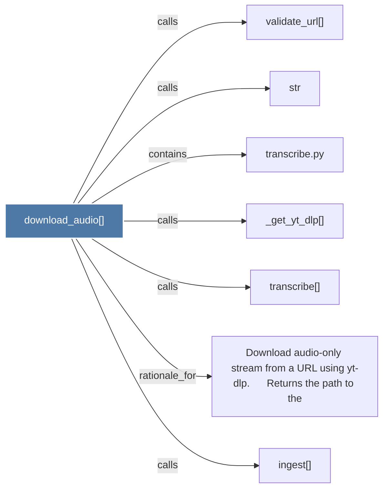

# download_audio()

> [!info] Properties
> **File Type**: code
> **Community**: [[_COMMUNITY_Community None|Community None]]
> **Degree**: 7

## Architecture Graph


## Outbound Connections
- [[Download audio-only stream from a URL using yt-dlp.      Returns the path to the]] - `rationale_for` [EXTRACTED]
- [[_get_yt_dlp()]] - `calls` [EXTRACTED]
- [[ingest()]] - `calls` [INFERRED]
- [[str]] - `calls` [INFERRED]
- [[transcribe()]] - `calls` [EXTRACTED]
- [[transcribe.py]] - `contains` [EXTRACTED]
- [[validate_url()]] - `calls` [INFERRED]

## Inbound Dependencies
> [!abstract]- Files that link here
```dataview
LIST
FROM [[download_audio()]]
```

#graphify/code #graphify/EXTRACTED #community/Community_None