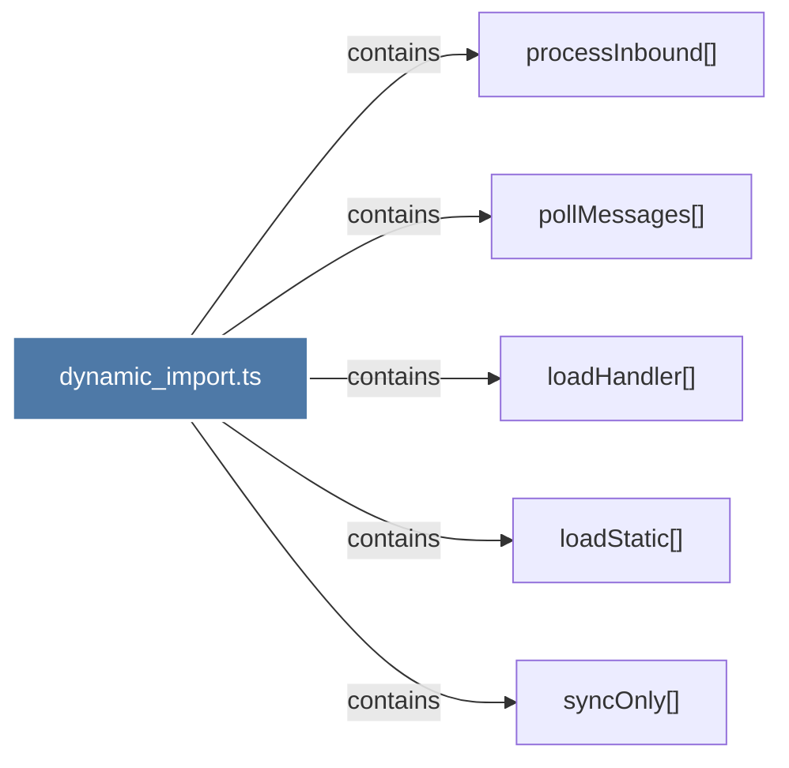

# dynamic_import.ts

> [!info] Properties
> **File Type**: code
> **Community**: [[_COMMUNITY_Community None|Community None]]
> **Degree**: 5

## Architecture Graph


## Outbound Connections
- [[loadHandler()]] - `contains` [EXTRACTED]
- [[loadStatic()]] - `contains` [EXTRACTED]
- [[pollMessages()]] - `contains` [EXTRACTED]
- [[processInbound()]] - `contains` [EXTRACTED]
- [[syncOnly()]] - `contains` [EXTRACTED]

## Inbound Dependencies
> [!abstract]- Files that link here
```dataview
LIST
FROM [[dynamic_import.ts]]
```

#graphify/code #graphify/EXTRACTED #community/Community_None