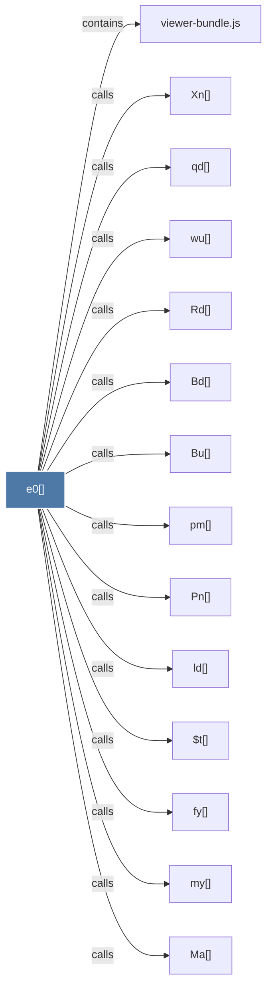

# e0()

> [!info] Properties
> **File Type**: code
> **Community**: [[_COMMUNITY_Community None|Community None]]
> **Degree**: 14

## Architecture Graph


## Outbound Connections
- [[$t()]] - `calls` [EXTRACTED]
- [[Bd()]] - `calls` [EXTRACTED]
- [[Bu()]] - `calls` [EXTRACTED]
- [[Ma()]] - `calls` [EXTRACTED]
- [[Pn()]] - `calls` [EXTRACTED]
- [[Rd()]] - `calls` [EXTRACTED]
- [[Xn()]] - `calls` [EXTRACTED]
- [[fy()]] - `calls` [EXTRACTED]
- [[ld()]] - `calls` [EXTRACTED]
- [[my()]] - `calls` [EXTRACTED]
- [[pm()]] - `calls` [EXTRACTED]
- [[qd()]] - `calls` [EXTRACTED]
- [[viewer-bundle.js]] - `contains` [EXTRACTED]
- [[wu()]] - `calls` [EXTRACTED]

## Inbound Dependencies
> [!abstract]- Files that link here
```dataview
LIST
FROM [[e0()]]
```

#graphify/code #graphify/EXTRACTED #community/Community_None