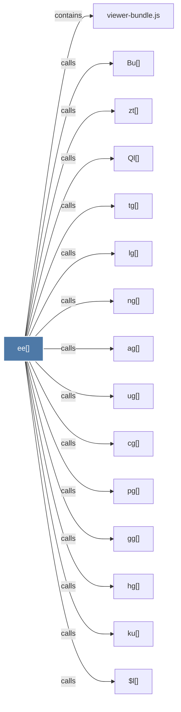

# ee()

> [!info] Properties
> **File Type**: code
> **Community**: [[_COMMUNITY_Community None|Community None]]
> **Degree**: 31

## Architecture Graph


## Outbound Connections
- [[$l()]] - `calls` [EXTRACTED]
- [[$t()]] - `calls` [EXTRACTED]
- [[Bu()]] - `calls` [EXTRACTED]
- [[It()]] - `calls` [EXTRACTED]
- [[Nh()]] - `calls` [EXTRACTED]
- [[Og()]] - `calls` [EXTRACTED]
- [[Ql()]] - `calls` [EXTRACTED]
- [[Zc()]] - `calls` [EXTRACTED]
- [[_g()]] - `calls` [EXTRACTED]
- [[ag()]] - `calls` [EXTRACTED]
- [[at()]] - `calls` [EXTRACTED]
- [[cg()]] - `calls` [EXTRACTED]
- [[ft()]] - `calls` [EXTRACTED]
- [[gg()]] - `calls` [EXTRACTED]
- [[hg()]] - `calls` [EXTRACTED]
- [[hu()]] - `calls` [EXTRACTED]
- [[jE()]] - `calls` [EXTRACTED]
- [[ku()]] - `calls` [EXTRACTED]
- [[lg()]] - `calls` [EXTRACTED]
- [[lh()]] - `calls` [EXTRACTED]
- [[ly()]] - `calls` [EXTRACTED]
- [[ng()]] - `calls` [EXTRACTED]
- [[od()]] - `calls` [EXTRACTED]
- [[pg()]] - `calls` [EXTRACTED]
- [[rh()]] - `calls` [EXTRACTED]
- [[sl()]] - `calls` [EXTRACTED]
- [[tg()]] - `calls` [EXTRACTED]
- [[ug()]] - `calls` [EXTRACTED]
- [[viewer-bundle.js]] - `contains` [EXTRACTED]
- [[xg()]] - `calls` [EXTRACTED]
- [[zt()]] - `calls` [EXTRACTED]

## Inbound Dependencies
> [!abstract]- Files that link here
```dataview
LIST
FROM [[ee()]]
```

#graphify/code #graphify/EXTRACTED #community/Community_None