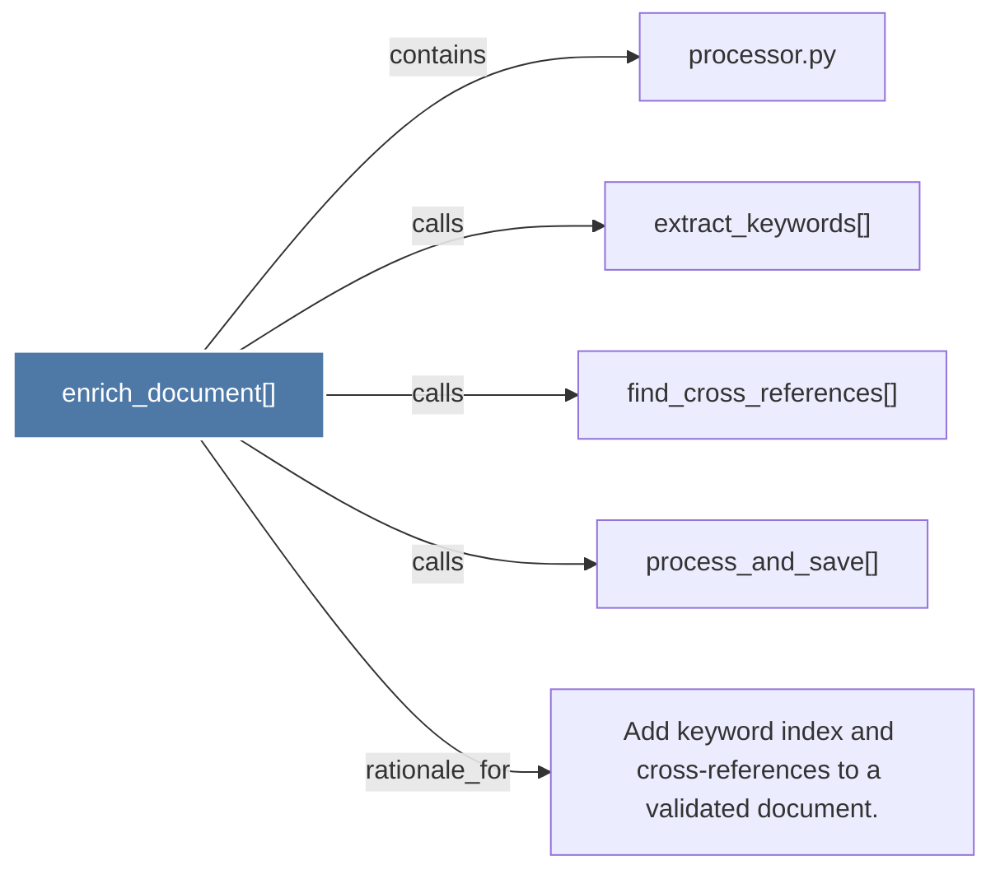

# enrich_document()

> [!info] Properties
> **File Type**: code
> **Community**: [[_COMMUNITY_Community None|Community None]]
> **Degree**: 5

## Architecture Graph


## Outbound Connections
- [[Add keyword index and cross-references to a validated document.]] - `rationale_for` [EXTRACTED]
- [[extract_keywords()]] - `calls` [EXTRACTED]
- [[find_cross_references()]] - `calls` [EXTRACTED]
- [[process_and_save()]] - `calls` [EXTRACTED]
- [[processor.py]] - `contains` [EXTRACTED]

## Inbound Dependencies
> [!abstract]- Files that link here
```dataview
LIST
FROM [[enrich_document()]]
```

#graphify/code #graphify/EXTRACTED #community/Community_None