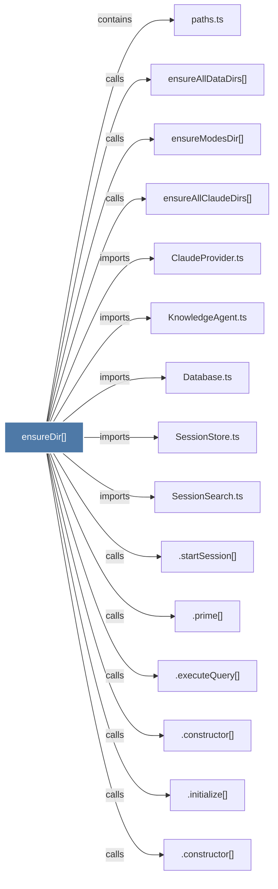

# ensureDir()

> [!info] Properties
> **File Type**: code
> **Community**: [[_COMMUNITY_Community None|Community None]]
> **Degree**: 16

## Architecture Graph


## Outbound Connections
- [[.constructor()_35]] - `calls` [INFERRED]
- [[.constructor()_36]] - `calls` [INFERRED]
- [[.constructor()_38]] - `calls` [INFERRED]
- [[.executeQuery()]] - `calls` [INFERRED]
- [[.initialize()_2]] - `calls` [INFERRED]
- [[.prime()]] - `calls` [INFERRED]
- [[.startSession()]] - `calls` [INFERRED]
- [[ClaudeProvider.ts]] - `imports` [EXTRACTED]
- [[Database.ts]] - `imports` [EXTRACTED]
- [[KnowledgeAgent.ts]] - `imports` [EXTRACTED]
- [[SessionSearch.ts]] - `imports` [EXTRACTED]
- [[SessionStore.ts]] - `imports` [EXTRACTED]
- [[ensureAllClaudeDirs()]] - `calls` [EXTRACTED]
- [[ensureAllDataDirs()]] - `calls` [EXTRACTED]
- [[ensureModesDir()]] - `calls` [EXTRACTED]
- [[paths.ts]] - `contains` [EXTRACTED]

## Inbound Dependencies
> [!abstract]- Files that link here
```dataview
LIST
FROM [[ensureDir()]]
```

#graphify/code #graphify/EXTRACTED #community/Community_None