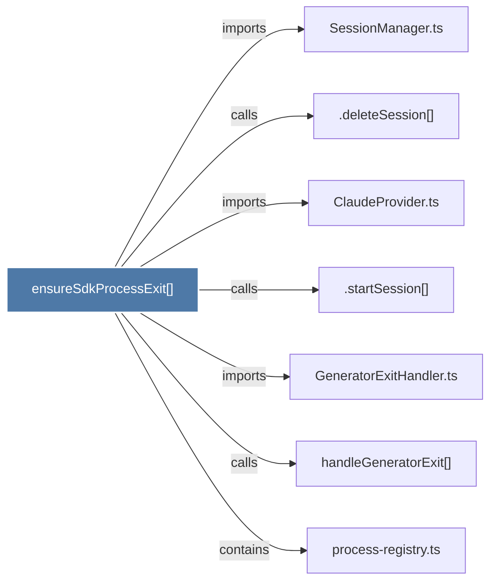

# ensureSdkProcessExit()

> [!info] Properties
> **File Type**: code
> **Community**: [[_COMMUNITY_Community None|Community None]]
> **Degree**: 7

## Architecture Graph


## Outbound Connections
- [[.deleteSession()]] - `calls` [INFERRED]
- [[.startSession()]] - `calls` [INFERRED]
- [[ClaudeProvider.ts]] - `imports` [EXTRACTED]
- [[GeneratorExitHandler.ts]] - `imports` [EXTRACTED]
- [[SessionManager.ts]] - `imports` [EXTRACTED]
- [[handleGeneratorExit()]] - `calls` [INFERRED]
- [[process-registry.ts]] - `contains` [EXTRACTED]

## Inbound Dependencies
> [!abstract]- Files that link here
```dataview
LIST
FROM [[ensureSdkProcessExit()]]
```

#graphify/code #graphify/EXTRACTED #community/Community_None