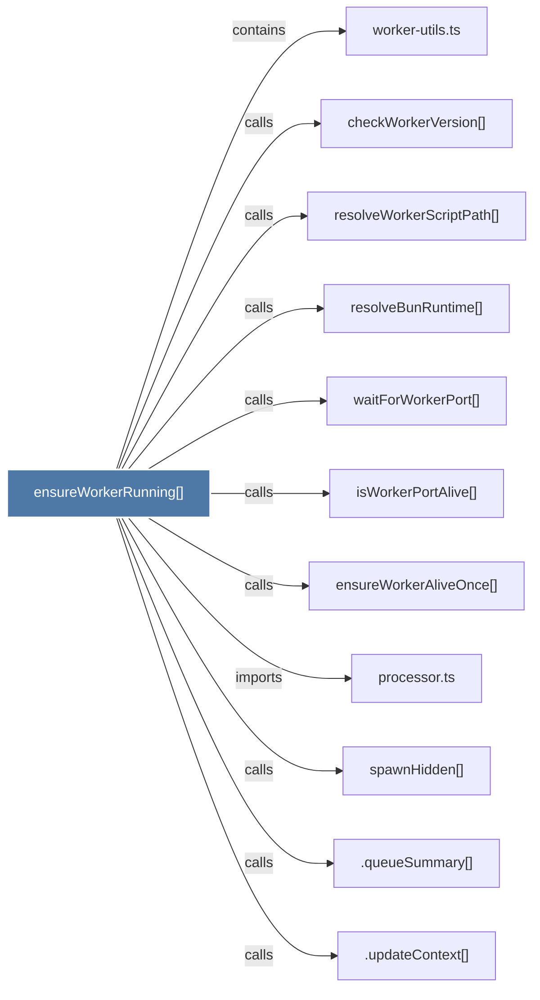

# ensureWorkerRunning()

> [!info] Properties
> **File Type**: code
> **Community**: [[_COMMUNITY_Community None|Community None]]
> **Degree**: 11

## Architecture Graph


## Outbound Connections
- [[.queueSummary()]] - `calls` [INFERRED]
- [[.updateContext()]] - `calls` [INFERRED]
- [[checkWorkerVersion()]] - `calls` [EXTRACTED]
- [[ensureWorkerAliveOnce()]] - `calls` [EXTRACTED]
- [[isWorkerPortAlive()]] - `calls` [EXTRACTED]
- [[processor.ts]] - `imports` [EXTRACTED]
- [[resolveBunRuntime()]] - `calls` [EXTRACTED]
- [[resolveWorkerScriptPath()]] - `calls` [EXTRACTED]
- [[spawnHidden()]] - `calls` [INFERRED]
- [[waitForWorkerPort()]] - `calls` [EXTRACTED]
- [[worker-utils.ts]] - `contains` [EXTRACTED]

## Inbound Dependencies
> [!abstract]- Files that link here
```dataview
LIST
FROM [[ensureWorkerRunning()]]
```

#graphify/code #graphify/EXTRACTED #community/Community_None