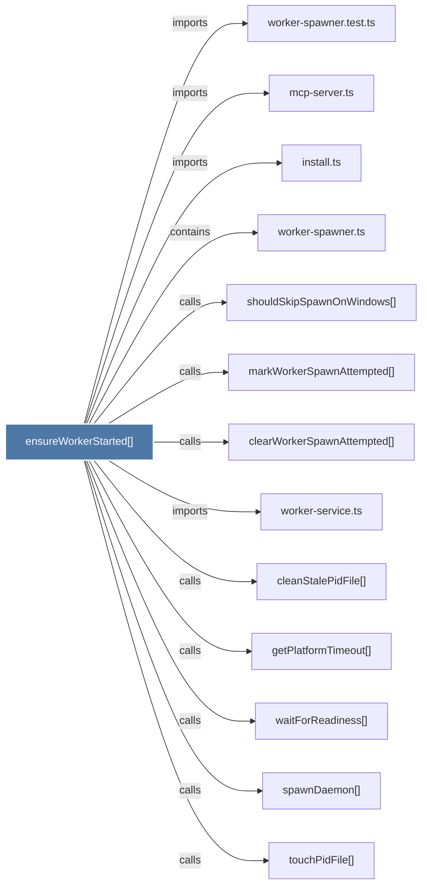

# ensureWorkerStarted()

> [!info] Properties
> **File Type**: code
> **Community**: [[_COMMUNITY_Community None|Community None]]
> **Degree**: 13

## Architecture Graph


## Outbound Connections
- [[cleanStalePidFile()]] - `calls` [INFERRED]
- [[clearWorkerSpawnAttempted()]] - `calls` [EXTRACTED]
- [[getPlatformTimeout()]] - `calls` [INFERRED]
- [[install.ts]] - `imports` [EXTRACTED]
- [[markWorkerSpawnAttempted()]] - `calls` [EXTRACTED]
- [[mcp-server.ts]] - `imports` [EXTRACTED]
- [[shouldSkipSpawnOnWindows()]] - `calls` [EXTRACTED]
- [[spawnDaemon()]] - `calls` [INFERRED]
- [[touchPidFile()]] - `calls` [INFERRED]
- [[waitForReadiness()]] - `calls` [INFERRED]
- [[worker-service.ts]] - `imports` [EXTRACTED]
- [[worker-spawner.test.ts]] - `imports` [EXTRACTED]
- [[worker-spawner.ts]] - `contains` [EXTRACTED]

## Inbound Dependencies
> [!abstract]- Files that link here
```dataview
LIST
FROM [[ensureWorkerStarted()]]
```

#graphify/code #graphify/EXTRACTED #community/Community_None