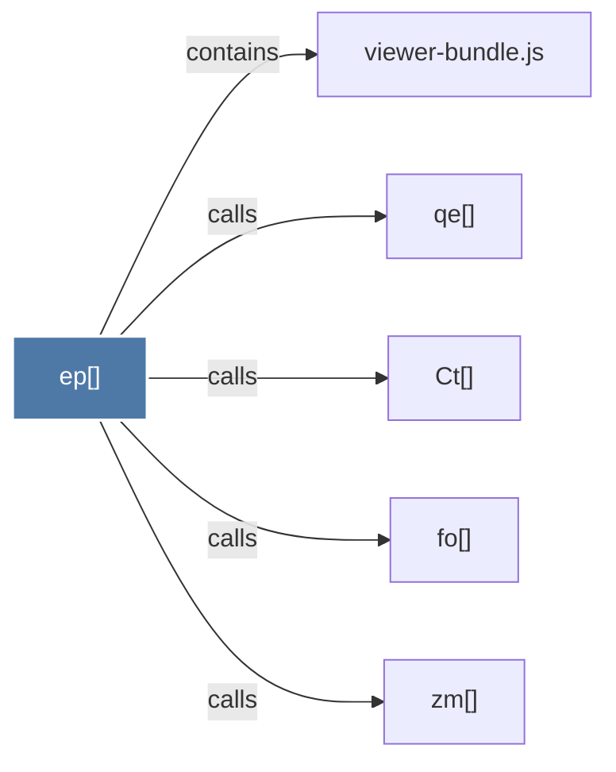

# ep()

> [!info] Properties
> **File Type**: code
> **Community**: [[_COMMUNITY_Community None|Community None]]
> **Degree**: 5

## Architecture Graph


## Outbound Connections
- [[Ct()]] - `calls` [EXTRACTED]
- [[fo()]] - `calls` [EXTRACTED]
- [[qe()]] - `calls` [EXTRACTED]
- [[viewer-bundle.js]] - `contains` [EXTRACTED]
- [[zm()]] - `calls` [EXTRACTED]

## Inbound Dependencies
> [!abstract]- Files that link here
```dataview
LIST
FROM [[ep()]]
```

#graphify/code #graphify/EXTRACTED #community/Community_None