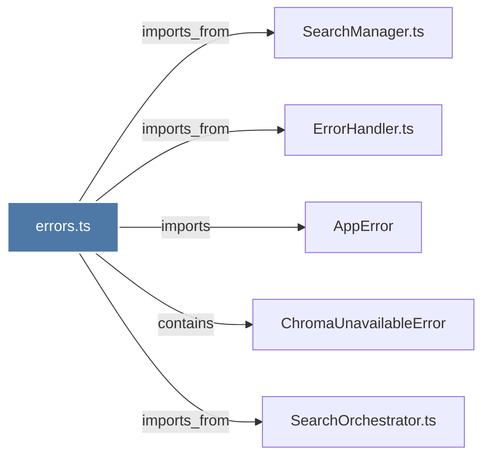

# errors.ts

> [!info] Properties
> **File Type**: code
> **Community**: [[_COMMUNITY_Community None|Community None]]
> **Degree**: 5

## Architecture Graph


## Outbound Connections
- [[AppError]] - `imports` [EXTRACTED]
- [[ChromaUnavailableError]] - `contains` [EXTRACTED]
- [[ErrorHandler.ts]] - `imports_from` [EXTRACTED]
- [[SearchManager.ts]] - `imports_from` [EXTRACTED]
- [[SearchOrchestrator.ts]] - `imports_from` [EXTRACTED]

## Inbound Dependencies
> [!abstract]- Files that link here
```dataview
LIST
FROM [[errors.ts_1]]
```

#graphify/code #graphify/EXTRACTED #community/Community_None