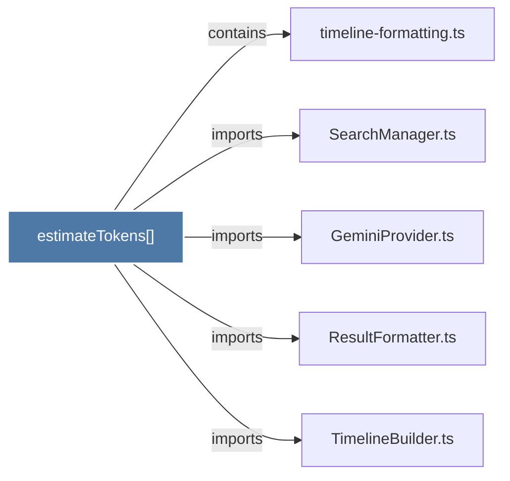

# estimateTokens()

> [!info] Properties
> **File Type**: code
> **Community**: [[_COMMUNITY_Community None|Community None]]
> **Degree**: 5

## Architecture Graph


## Outbound Connections
- [[GeminiProvider.ts]] - `imports` [EXTRACTED]
- [[ResultFormatter.ts]] - `imports` [EXTRACTED]
- [[SearchManager.ts]] - `imports` [EXTRACTED]
- [[TimelineBuilder.ts]] - `imports` [EXTRACTED]
- [[timeline-formatting.ts]] - `contains` [EXTRACTED]

## Inbound Dependencies
> [!abstract]- Files that link here
```dataview
LIST
FROM [[estimateTokens()_1]]
```

#graphify/code #graphify/EXTRACTED #community/Community_None