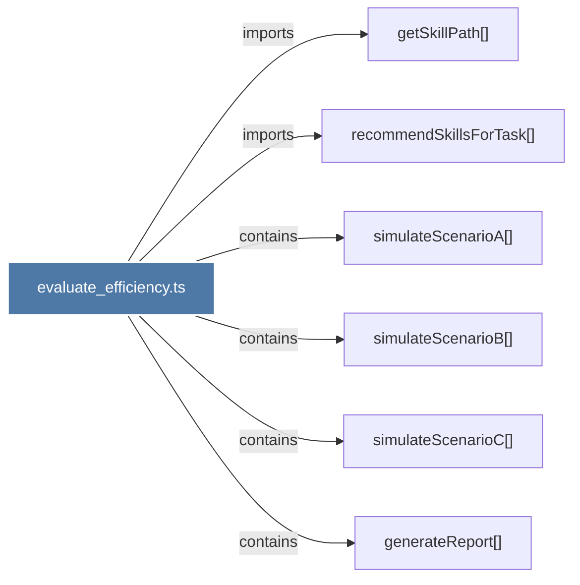

# evaluate_efficiency.ts

> [!info] Properties
> **File Type**: code
> **Community**: [[_COMMUNITY_Community None|Community None]]
> **Degree**: 6

## Architecture Graph


## Outbound Connections
- [[generateReport()_1]] - `contains` [EXTRACTED]
- [[getSkillPath()]] - `imports` [EXTRACTED]
- [[recommendSkillsForTask()]] - `imports` [EXTRACTED]
- [[simulateScenarioA()]] - `contains` [EXTRACTED]
- [[simulateScenarioB()]] - `contains` [EXTRACTED]
- [[simulateScenarioC()]] - `contains` [EXTRACTED]

## Inbound Dependencies
> [!abstract]- Files that link here
```dataview
LIST
FROM [[evaluate_efficiency.ts]]
```

#graphify/code #graphify/EXTRACTED #community/Community_None