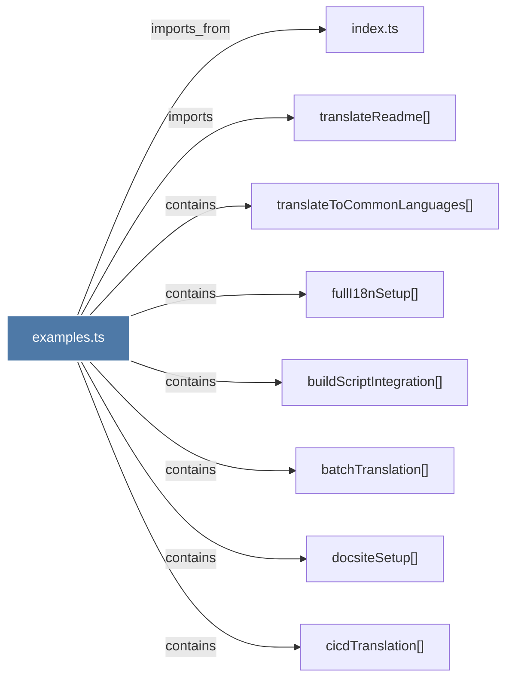

# examples.ts

> [!info] Properties
> **File Type**: code
> **Community**: [[_COMMUNITY_Community None|Community None]]
> **Degree**: 8

## Architecture Graph


## Outbound Connections
- [[batchTranslation()]] - `contains` [EXTRACTED]
- [[buildScriptIntegration()]] - `contains` [EXTRACTED]
- [[cicdTranslation()]] - `contains` [EXTRACTED]
- [[docsiteSetup()]] - `contains` [EXTRACTED]
- [[fullI18nSetup()]] - `contains` [EXTRACTED]
- [[index.ts_14]] - `imports_from` [EXTRACTED]
- [[translateReadme()]] - `imports` [EXTRACTED]
- [[translateToCommonLanguages()]] - `contains` [EXTRACTED]

## Inbound Dependencies
> [!abstract]- Files that link here
```dataview
LIST
FROM [[examples.ts]]
```

#graphify/code #graphify/EXTRACTED #community/Community_None