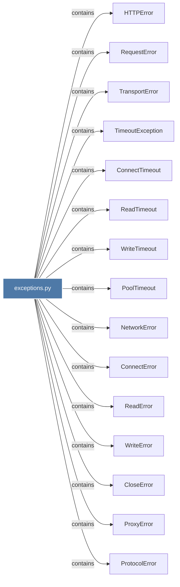

# exceptions.py

> [!info] Properties
> **File Type**: code
> **Community**: [[_COMMUNITY_Community None|Community None]]
> **Degree**: 21

## Architecture Graph


## Outbound Connections
- [[CloseError]] - `contains` [EXTRACTED]
- [[ConnectError]] - `contains` [EXTRACTED]
- [[ConnectTimeout]] - `contains` [EXTRACTED]
- [[CookieConflict]] - `contains` [EXTRACTED]
- [[DecodingError]] - `contains` [EXTRACTED]
- [[HTTPError]] - `contains` [EXTRACTED]
- [[HTTPStatusError]] - `contains` [EXTRACTED]
- [[InvalidURL]] - `contains` [EXTRACTED]
- [[NetworkError_1]] - `contains` [EXTRACTED]
- [[PoolTimeout]] - `contains` [EXTRACTED]
- [[ProtocolError]] - `contains` [EXTRACTED]
- [[ProxyError]] - `contains` [EXTRACTED]
- [[ReadError]] - `contains` [EXTRACTED]
- [[ReadTimeout]] - `contains` [EXTRACTED]
- [[RequestError]] - `contains` [EXTRACTED]
- [[TimeoutException]] - `contains` [EXTRACTED]
- [[TooManyRedirects]] - `contains` [EXTRACTED]
- [[TransportError]] - `contains` [EXTRACTED]
- [[WriteError]] - `contains` [EXTRACTED]
- [[WriteTimeout]] - `contains` [EXTRACTED]
- [[httpx-like exception hierarchy. All exceptions inherit from HTTPError at the top]] - `rationale_for` [EXTRACTED]

## Inbound Dependencies
> [!abstract]- Files that link here
```dataview
LIST
FROM [[exceptions.py]]
```

#graphify/code #graphify/EXTRACTED #community/Community_None