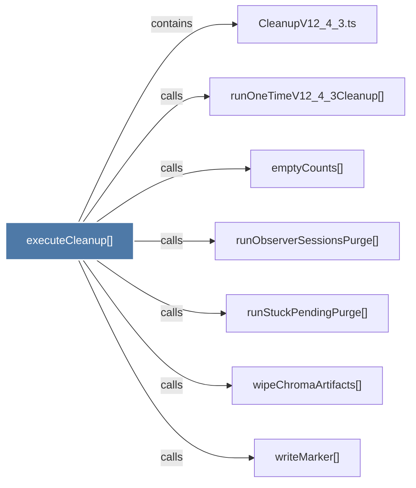

# executeCleanup()

> [!info] Properties
> **File Type**: code
> **Community**: [[_COMMUNITY_Community None|Community None]]
> **Degree**: 7

## Architecture Graph


## Outbound Connections
- [[CleanupV12_4_3.ts]] - `contains` [EXTRACTED]
- [[emptyCounts()]] - `calls` [EXTRACTED]
- [[runObserverSessionsPurge()]] - `calls` [EXTRACTED]
- [[runOneTimeV12_4_3Cleanup()]] - `calls` [EXTRACTED]
- [[runStuckPendingPurge()]] - `calls` [EXTRACTED]
- [[wipeChromaArtifacts()]] - `calls` [EXTRACTED]
- [[writeMarker()]] - `calls` [EXTRACTED]

## Inbound Dependencies
> [!abstract]- Files that link here
```dataview
LIST
FROM [[executeCleanup()]]
```

#graphify/code #graphify/EXTRACTED #community/Community_None