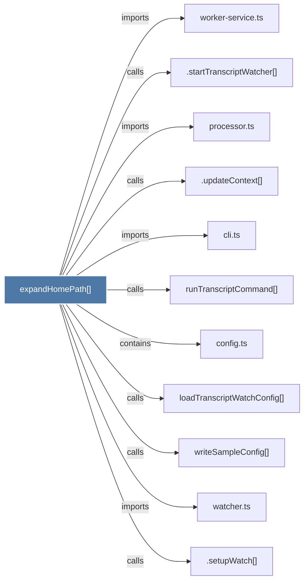

# expandHomePath()

> [!info] Properties
> **File Type**: code
> **Community**: [[_COMMUNITY_Community None|Community None]]
> **Degree**: 11

## Architecture Graph


## Outbound Connections
- [[.setupWatch()]] - `calls` [INFERRED]
- [[.startTranscriptWatcher()]] - `calls` [INFERRED]
- [[.updateContext()]] - `calls` [INFERRED]
- [[cli.ts]] - `imports` [EXTRACTED]
- [[config.ts]] - `contains` [EXTRACTED]
- [[loadTranscriptWatchConfig()]] - `calls` [EXTRACTED]
- [[processor.ts]] - `imports` [EXTRACTED]
- [[runTranscriptCommand()]] - `calls` [INFERRED]
- [[watcher.ts]] - `imports` [EXTRACTED]
- [[worker-service.ts]] - `imports` [EXTRACTED]
- [[writeSampleConfig()]] - `calls` [EXTRACTED]

## Inbound Dependencies
> [!abstract]- Files that link here
```dataview
LIST
FROM [[expandHomePath()]]
```

#graphify/code #graphify/EXTRACTED #community/Community_None