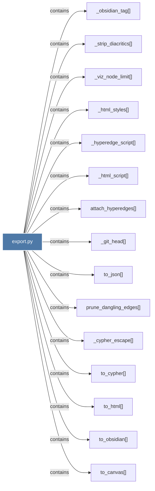

# export.py

> [!info] Properties
> **File Type**: code
> **Community**: [[_COMMUNITY_Community None|Community None]]
> **Degree**: 18

## Architecture Graph


## Outbound Connections
- [[_cypher_escape()]] - `contains` [EXTRACTED]
- [[_git_head()]] - `contains` [EXTRACTED]
- [[_html_script()]] - `contains` [EXTRACTED]
- [[_html_styles()]] - `contains` [EXTRACTED]
- [[_hyperedge_script()]] - `contains` [EXTRACTED]
- [[_obsidian_tag()]] - `contains` [EXTRACTED]
- [[_strip_diacritics()]] - `contains` [EXTRACTED]
- [[_viz_node_limit()]] - `contains` [EXTRACTED]
- [[attach_hyperedges()]] - `contains` [EXTRACTED]
- [[prune_dangling_edges()]] - `contains` [EXTRACTED]
- [[push_to_neo4j()]] - `contains` [EXTRACTED]
- [[to_canvas()]] - `contains` [EXTRACTED]
- [[to_cypher()]] - `contains` [EXTRACTED]
- [[to_graphml()]] - `contains` [EXTRACTED]
- [[to_html()]] - `contains` [EXTRACTED]
- [[to_json()]] - `contains` [EXTRACTED]
- [[to_obsidian()]] - `contains` [EXTRACTED]
- [[to_svg()]] - `contains` [EXTRACTED]

## Inbound Dependencies
> [!abstract]- Files that link here
```dataview
LIST
FROM [[export.py]]
```

#graphify/code #graphify/EXTRACTED #community/Community_None