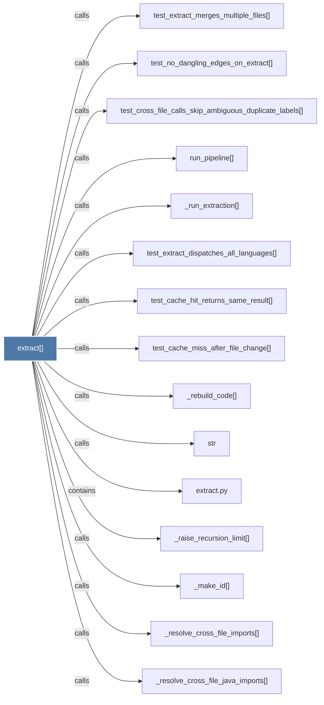

# extract()

> [!info] Properties
> **File Type**: code
> **Community**: [[_COMMUNITY_Community None|Community None]]
> **Degree**: 21

## Architecture Graph


## Outbound Connections
- [[Extract AST nodes and edges from a list of code files.      Two-pass process]] - `rationale_for` [EXTRACTED]
- [[_check_tree_sitter_version()]] - `calls` [EXTRACTED]
- [[_extract_parallel()]] - `calls` [EXTRACTED]
- [[_extract_sequential()]] - `calls` [EXTRACTED]
- [[_get_extractor()]] - `calls` [EXTRACTED]
- [[_make_id()]] - `calls` [EXTRACTED]
- [[_raise_recursion_limit()]] - `calls` [EXTRACTED]
- [[_rebuild_code()]] - `calls` [INFERRED]
- [[_resolve_cross_file_imports()]] - `calls` [EXTRACTED]
- [[_resolve_cross_file_java_imports()]] - `calls` [EXTRACTED]
- [[_run_extraction()]] - `calls` [INFERRED]
- [[extract.py]] - `contains` [EXTRACTED]
- [[load_cached()]] - `calls` [INFERRED]
- [[run_pipeline()]] - `calls` [INFERRED]
- [[str]] - `calls` [INFERRED]
- [[test_cache_hit_returns_same_result()]] - `calls` [INFERRED]
- [[test_cache_miss_after_file_change()]] - `calls` [INFERRED]
- [[test_cross_file_calls_skip_ambiguous_duplicate_labels()]] - `calls` [INFERRED]
- [[test_extract_dispatches_all_languages()]] - `calls` [INFERRED]
- [[test_extract_merges_multiple_files()]] - `calls` [INFERRED]
- [[test_no_dangling_edges_on_extract()]] - `calls` [INFERRED]

## Inbound Dependencies
> [!abstract]- Files that link here
```dataview
LIST
FROM [[extract()]]
```

#graphify/code #graphify/INFERRED #community/Community_None