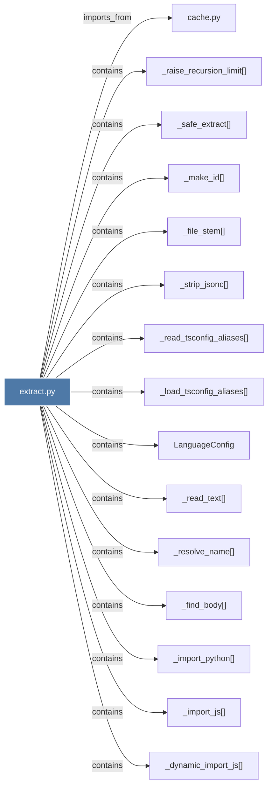

# extract.py

> [!info] Properties
> **File Type**: code
> **Community**: [[_COMMUNITY_Community None|Community None]]
> **Degree**: 67

## Architecture Graph


## Outbound Connections
- [[Deterministic structural extraction from source code using tree-sitter. Outputs]] - `rationale_for` [EXTRACTED]
- [[LanguageConfig]] - `contains` [EXTRACTED]
- [[_check_tree_sitter_version()]] - `contains` [EXTRACTED]
- [[_cpp_preprocess()]] - `contains` [EXTRACTED]
- [[_csharp_extra_walk()]] - `contains` [EXTRACTED]
- [[_dynamic_import_js()]] - `contains` [EXTRACTED]
- [[_extract_generic()]] - `contains` [EXTRACTED]
- [[_extract_parallel()]] - `contains` [EXTRACTED]
- [[_extract_python_rationale()]] - `contains` [EXTRACTED]
- [[_extract_sequential()]] - `contains` [EXTRACTED]
- [[_extract_single_file()]] - `contains` [EXTRACTED]
- [[_file_stem()]] - `contains` [EXTRACTED]
- [[_find_body()]] - `contains` [EXTRACTED]
- [[_get_c_func_name()]] - `contains` [EXTRACTED]
- [[_get_cpp_func_name()]] - `contains` [EXTRACTED]
- [[_get_extractor()]] - `contains` [EXTRACTED]
- [[_import_c()]] - `contains` [EXTRACTED]
- [[_import_csharp()]] - `contains` [EXTRACTED]
- [[_import_java()]] - `contains` [EXTRACTED]
- [[_import_js()]] - `contains` [EXTRACTED]
- [[_import_kotlin()]] - `contains` [EXTRACTED]
- [[_import_lua()]] - `contains` [EXTRACTED]
- [[_import_php()]] - `contains` [EXTRACTED]
- [[_import_python()]] - `contains` [EXTRACTED]
- [[_import_scala()]] - `contains` [EXTRACTED]
- [[_import_swift()]] - `contains` [EXTRACTED]
- [[_js_extra_walk()]] - `contains` [EXTRACTED]
- [[_load_tsconfig_aliases()]] - `contains` [EXTRACTED]
- [[_make_id()]] - `contains` [EXTRACTED]
- [[_raise_recursion_limit()]] - `contains` [EXTRACTED]
- [[_read_csharp_type_name()]] - `contains` [EXTRACTED]
- [[_read_text()]] - `contains` [EXTRACTED]
- [[_read_tsconfig_aliases()]] - `contains` [EXTRACTED]
- [[_resolve_cross_file_imports()]] - `contains` [EXTRACTED]
- [[_resolve_cross_file_java_imports()]] - `contains` [EXTRACTED]
- [[_resolve_name()]] - `contains` [EXTRACTED]
- [[_safe_extract()]] - `contains` [EXTRACTED]
- [[_strip_jsonc()]] - `contains` [EXTRACTED]
- [[_swift_extra_walk()]] - `contains` [EXTRACTED]
- [[cache.py]] - `imports_from` [EXTRACTED]
- [[collect_files()]] - `contains` [EXTRACTED]
- [[extract()]] - `contains` [EXTRACTED]
- [[extract_blade()]] - `contains` [EXTRACTED]
- [[extract_c()]] - `contains` [EXTRACTED]
- [[extract_cpp()]] - `contains` [EXTRACTED]
- [[extract_csharp()]] - `contains` [EXTRACTED]
- [[extract_dart()]] - `contains` [EXTRACTED]
- [[extract_elixir()]] - `contains` [EXTRACTED]
- [[extract_fortran()]] - `contains` [EXTRACTED]
- [[extract_go()]] - `contains` [EXTRACTED]
- [[extract_java()]] - `contains` [EXTRACTED]
- [[extract_js()]] - `contains` [EXTRACTED]
- [[extract_julia()]] - `contains` [EXTRACTED]
- [[extract_kotlin()]] - `contains` [EXTRACTED]
- [[extract_lua()]] - `contains` [EXTRACTED]
- [[extract_objc()]] - `contains` [EXTRACTED]
- [[extract_php()]] - `contains` [EXTRACTED]
- [[extract_powershell()]] - `contains` [EXTRACTED]
- [[extract_python()]] - `contains` [EXTRACTED]
- [[extract_ruby()]] - `contains` [EXTRACTED]
- [[extract_rust()]] - `contains` [EXTRACTED]
- [[extract_scala()]] - `contains` [EXTRACTED]
- [[extract_sql()]] - `contains` [EXTRACTED]
- [[extract_svelte()]] - `contains` [EXTRACTED]
- [[extract_swift()]] - `contains` [EXTRACTED]
- [[extract_verilog()]] - `contains` [EXTRACTED]
- [[extract_zig()]] - `contains` [EXTRACTED]

## Inbound Dependencies
> [!abstract]- Files that link here
```dataview
LIST
FROM [[extract.py]]
```

#graphify/code #graphify/EXTRACTED #community/Community_None