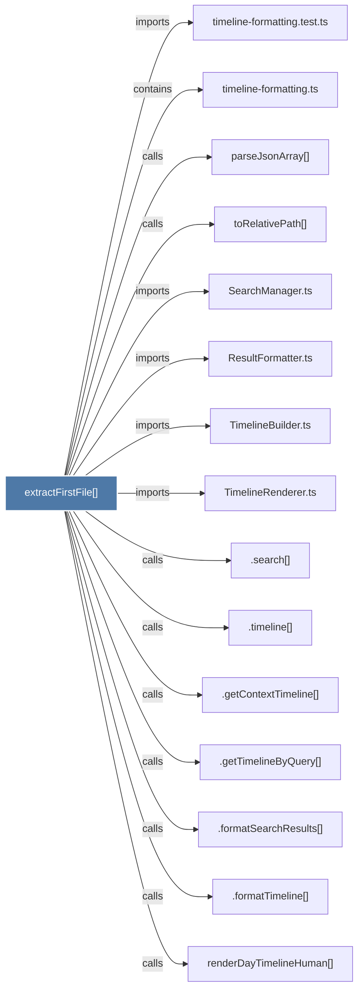

# extractFirstFile()

> [!info] Properties
> **File Type**: code
> **Community**: [[_COMMUNITY_Community None|Community None]]
> **Degree**: 15

## Architecture Graph


## Outbound Connections
- [[.formatSearchResults()]] - `calls` [INFERRED]
- [[.formatTimeline()_2]] - `calls` [INFERRED]
- [[.getContextTimeline()]] - `calls` [INFERRED]
- [[.getTimelineByQuery()]] - `calls` [INFERRED]
- [[.search()]] - `calls` [INFERRED]
- [[.timeline()]] - `calls` [INFERRED]
- [[ResultFormatter.ts]] - `imports` [EXTRACTED]
- [[SearchManager.ts]] - `imports` [EXTRACTED]
- [[TimelineBuilder.ts]] - `imports` [EXTRACTED]
- [[TimelineRenderer.ts]] - `imports` [EXTRACTED]
- [[parseJsonArray()]] - `calls` [EXTRACTED]
- [[renderDayTimelineHuman()]] - `calls` [INFERRED]
- [[timeline-formatting.test.ts]] - `imports` [EXTRACTED]
- [[timeline-formatting.ts]] - `contains` [EXTRACTED]
- [[toRelativePath()]] - `calls` [EXTRACTED]

## Inbound Dependencies
> [!abstract]- Files that link here
```dataview
LIST
FROM [[extractFirstFile()]]
```

#graphify/code #graphify/EXTRACTED #community/Community_None