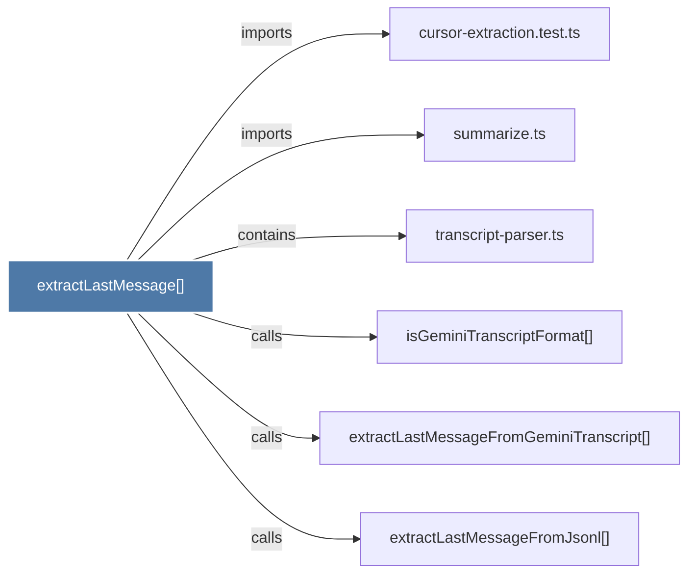

# extractLastMessage()

> [!info] Properties
> **File Type**: code
> **Community**: [[_COMMUNITY_Community None|Community None]]
> **Degree**: 6

## Architecture Graph


## Outbound Connections
- [[cursor-extraction.test.ts]] - `imports` [EXTRACTED]
- [[extractLastMessageFromGeminiTranscript()]] - `calls` [EXTRACTED]
- [[extractLastMessageFromJsonl()]] - `calls` [EXTRACTED]
- [[isGeminiTranscriptFormat()]] - `calls` [EXTRACTED]
- [[summarize.ts]] - `imports` [EXTRACTED]
- [[transcript-parser.ts]] - `contains` [EXTRACTED]

## Inbound Dependencies
> [!abstract]- Files that link here
```dataview
LIST
FROM [[extractLastMessage()]]
```

#graphify/code #graphify/EXTRACTED #community/Community_None