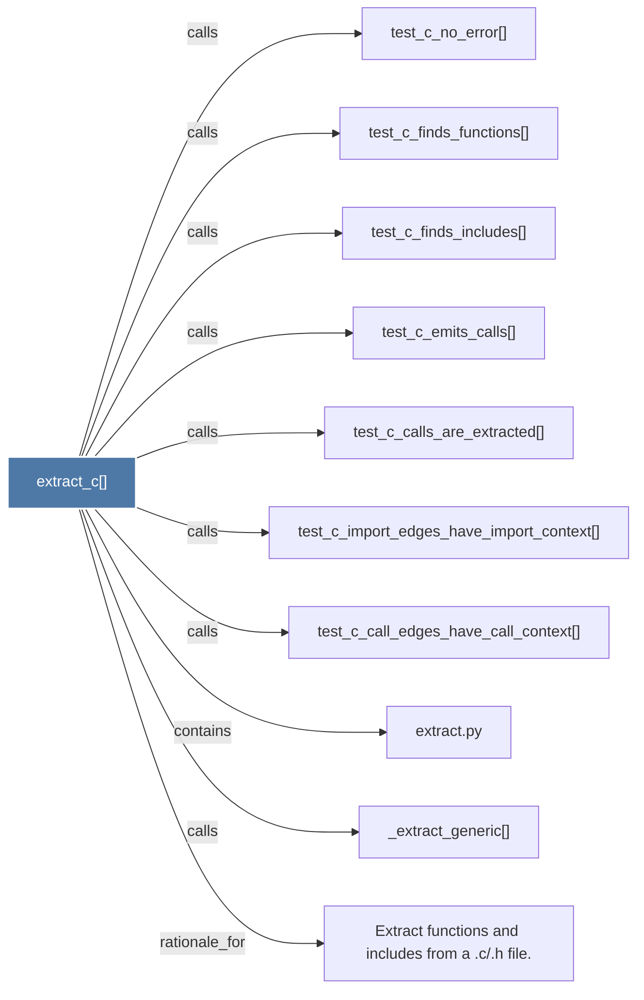

# extract_c()

> [!info] Properties
> **File Type**: code
> **Community**: [[_COMMUNITY_Community None|Community None]]
> **Degree**: 10

## Architecture Graph


## Outbound Connections
- [[Extract functions and includes from a .c.h file.]] - `rationale_for` [EXTRACTED]
- [[_extract_generic()]] - `calls` [EXTRACTED]
- [[extract.py]] - `contains` [EXTRACTED]
- [[test_c_call_edges_have_call_context()]] - `calls` [INFERRED]
- [[test_c_calls_are_extracted()]] - `calls` [INFERRED]
- [[test_c_emits_calls()]] - `calls` [INFERRED]
- [[test_c_finds_functions()]] - `calls` [INFERRED]
- [[test_c_finds_includes()]] - `calls` [INFERRED]
- [[test_c_import_edges_have_import_context()]] - `calls` [INFERRED]
- [[test_c_no_error()]] - `calls` [INFERRED]

## Inbound Dependencies
> [!abstract]- Files that link here
```dataview
LIST
FROM [[extract_c()]]
```

#graphify/code #graphify/INFERRED #community/Community_None