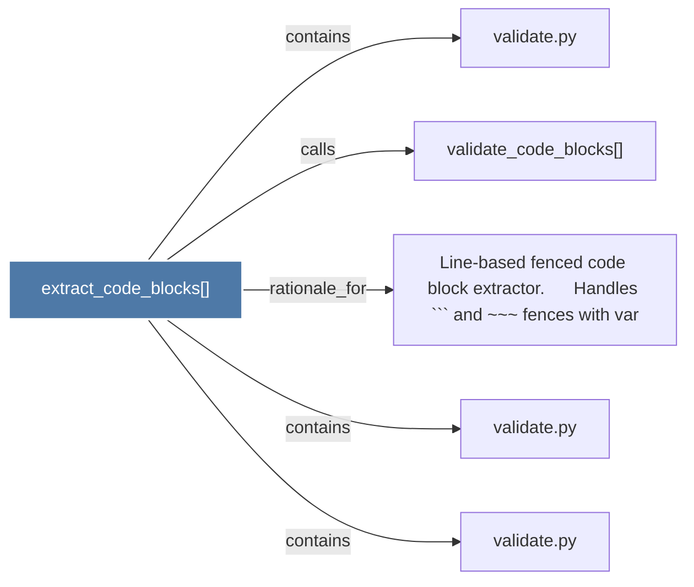

# extract_code_blocks()

> [!info] Properties
> **File Type**: code
> **Community**: [[_COMMUNITY_Community None|Community None]]
> **Degree**: 5

## Architecture Graph


## Outbound Connections
- [[Line-based fenced code block extractor.      Handles ``` and ~~~ fences with var]] - `rationale_for` [EXTRACTED]
- [[validate.py_1]] - `contains` [EXTRACTED]
- [[validate.py_2]] - `contains` [EXTRACTED]
- [[validate.py_3]] - `contains` [EXTRACTED]
- [[validate_code_blocks()]] - `calls` [EXTRACTED]

## Inbound Dependencies
> [!abstract]- Files that link here
```dataview
LIST
FROM [[extract_code_blocks()]]
```

#graphify/code #graphify/EXTRACTED #community/Community_None