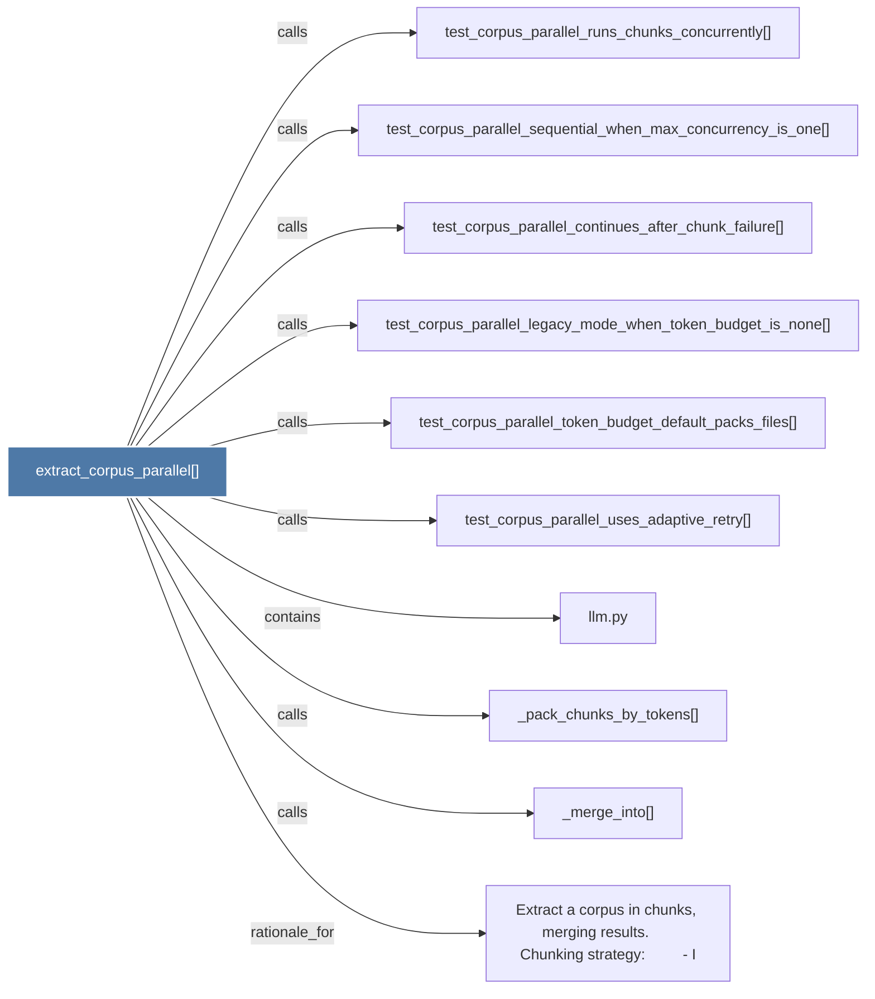

# extract_corpus_parallel()

> [!info] Properties
> **File Type**: code
> **Community**: [[_COMMUNITY_Community None|Community None]]
> **Degree**: 10

## Architecture Graph


## Outbound Connections
- [[Extract a corpus in chunks, merging results.      Chunking strategy         - I]] - `rationale_for` [EXTRACTED]
- [[_merge_into()]] - `calls` [EXTRACTED]
- [[_pack_chunks_by_tokens()]] - `calls` [EXTRACTED]
- [[llm.py]] - `contains` [EXTRACTED]
- [[test_corpus_parallel_continues_after_chunk_failure()]] - `calls` [INFERRED]
- [[test_corpus_parallel_legacy_mode_when_token_budget_is_none()]] - `calls` [INFERRED]
- [[test_corpus_parallel_runs_chunks_concurrently()]] - `calls` [INFERRED]
- [[test_corpus_parallel_sequential_when_max_concurrency_is_one()]] - `calls` [INFERRED]
- [[test_corpus_parallel_token_budget_default_packs_files()]] - `calls` [INFERRED]
- [[test_corpus_parallel_uses_adaptive_retry()]] - `calls` [INFERRED]

## Inbound Dependencies
> [!abstract]- Files that link here
```dataview
LIST
FROM [[extract_corpus_parallel()]]
```

#graphify/code #graphify/INFERRED #community/Community_None