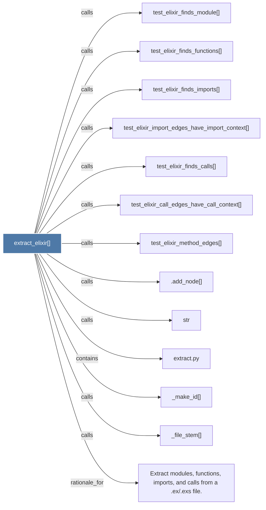

# extract_elixir()

> [!info] Properties
> **File Type**: code
> **Community**: [[_COMMUNITY_Community None|Community None]]
> **Degree**: 13

## Architecture Graph


## Outbound Connections
- [[.add_node()]] - `calls` [INFERRED]
- [[Extract modules, functions, imports, and calls from a .ex.exs file.]] - `rationale_for` [EXTRACTED]
- [[_file_stem()]] - `calls` [EXTRACTED]
- [[_make_id()]] - `calls` [EXTRACTED]
- [[extract.py]] - `contains` [EXTRACTED]
- [[str]] - `calls` [INFERRED]
- [[test_elixir_call_edges_have_call_context()]] - `calls` [INFERRED]
- [[test_elixir_finds_calls()]] - `calls` [INFERRED]
- [[test_elixir_finds_functions()]] - `calls` [INFERRED]
- [[test_elixir_finds_imports()]] - `calls` [INFERRED]
- [[test_elixir_finds_module()]] - `calls` [INFERRED]
- [[test_elixir_import_edges_have_import_context()]] - `calls` [INFERRED]
- [[test_elixir_method_edges()]] - `calls` [INFERRED]

## Inbound Dependencies
> [!abstract]- Files that link here
```dataview
LIST
FROM [[extract_elixir()]]
```

#graphify/code #graphify/INFERRED #community/Community_None