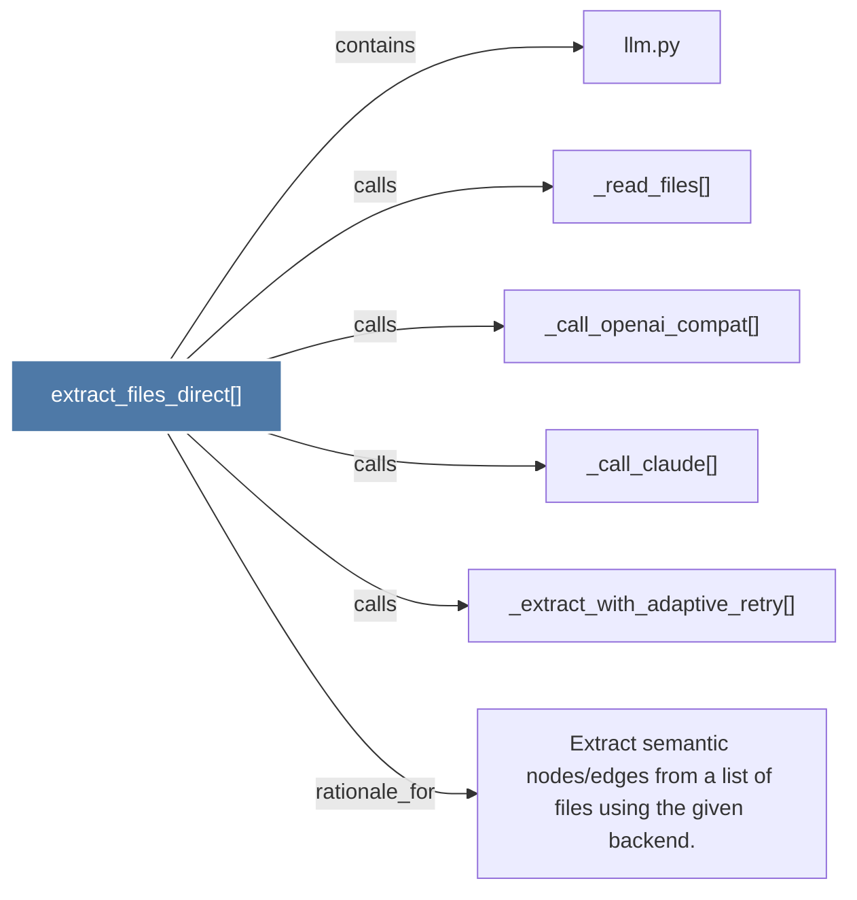

# extract_files_direct()

> [!info] Properties
> **File Type**: code
> **Community**: [[_COMMUNITY_Community None|Community None]]
> **Degree**: 6

## Architecture Graph


## Outbound Connections
- [[Extract semantic nodesedges from a list of files using the given backend.]] - `rationale_for` [EXTRACTED]
- [[_call_claude()]] - `calls` [EXTRACTED]
- [[_call_openai_compat()]] - `calls` [EXTRACTED]
- [[_extract_with_adaptive_retry()]] - `calls` [EXTRACTED]
- [[_read_files()]] - `calls` [EXTRACTED]
- [[llm.py]] - `contains` [EXTRACTED]

## Inbound Dependencies
> [!abstract]- Files that link here
```dataview
LIST
FROM [[extract_files_direct()]]
```

#graphify/code #graphify/EXTRACTED #community/Community_None