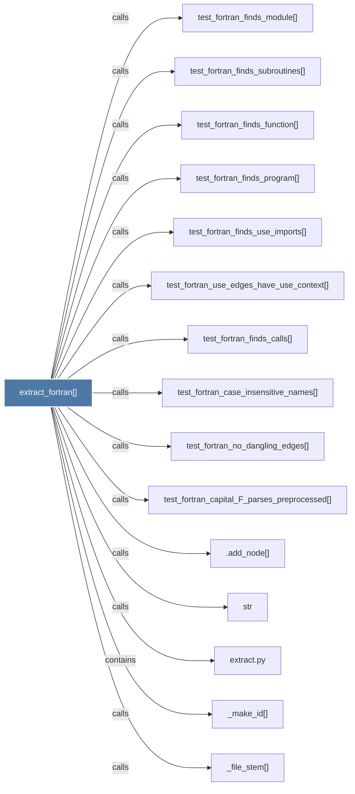

# extract_fortran()

> [!info] Properties
> **File Type**: code
> **Community**: [[_COMMUNITY_Community None|Community None]]
> **Degree**: 17

## Architecture Graph


## Outbound Connections
- [[.add_node()]] - `calls` [INFERRED]
- [[Extract programs, modules, subroutines, functions, use statements, and calls fro]] - `rationale_for` [EXTRACTED]
- [[_cpp_preprocess()]] - `calls` [EXTRACTED]
- [[_file_stem()]] - `calls` [EXTRACTED]
- [[_make_id()]] - `calls` [EXTRACTED]
- [[extract.py]] - `contains` [EXTRACTED]
- [[str]] - `calls` [INFERRED]
- [[test_fortran_capital_F_parses_preprocessed()]] - `calls` [INFERRED]
- [[test_fortran_case_insensitive_names()]] - `calls` [INFERRED]
- [[test_fortran_finds_calls()]] - `calls` [INFERRED]
- [[test_fortran_finds_function()]] - `calls` [INFERRED]
- [[test_fortran_finds_module()]] - `calls` [INFERRED]
- [[test_fortran_finds_program()]] - `calls` [INFERRED]
- [[test_fortran_finds_subroutines()]] - `calls` [INFERRED]
- [[test_fortran_finds_use_imports()]] - `calls` [INFERRED]
- [[test_fortran_no_dangling_edges()]] - `calls` [INFERRED]
- [[test_fortran_use_edges_have_use_context()]] - `calls` [INFERRED]

## Inbound Dependencies
> [!abstract]- Files that link here
```dataview
LIST
FROM [[extract_fortran()]]
```

#graphify/code #graphify/INFERRED #community/Community_None