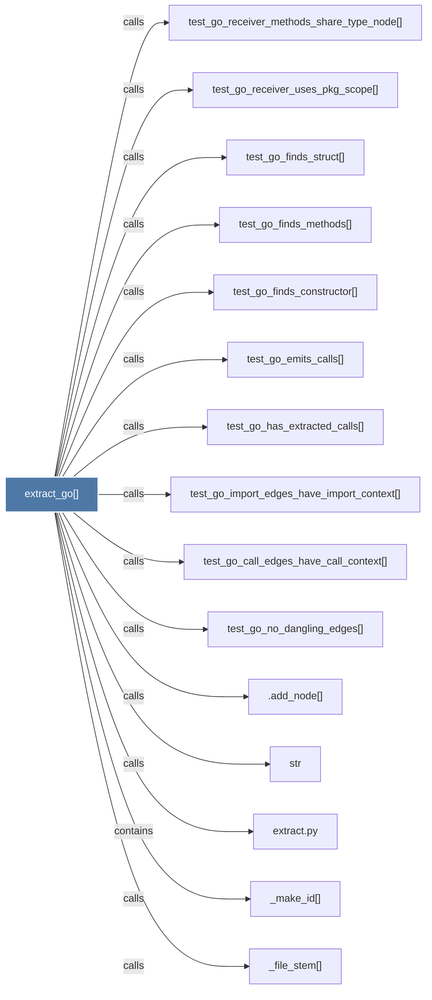

# extract_go()

> [!info] Properties
> **File Type**: code
> **Community**: [[_COMMUNITY_Community None|Community None]]
> **Degree**: 16

## Architecture Graph


## Outbound Connections
- [[.add_node()]] - `calls` [INFERRED]
- [[Extract functions, methods, type declarations, and imports from a .go file.]] - `rationale_for` [EXTRACTED]
- [[_file_stem()]] - `calls` [EXTRACTED]
- [[_make_id()]] - `calls` [EXTRACTED]
- [[extract.py]] - `contains` [EXTRACTED]
- [[str]] - `calls` [INFERRED]
- [[test_go_call_edges_have_call_context()]] - `calls` [INFERRED]
- [[test_go_emits_calls()]] - `calls` [INFERRED]
- [[test_go_finds_constructor()]] - `calls` [INFERRED]
- [[test_go_finds_methods()]] - `calls` [INFERRED]
- [[test_go_finds_struct()]] - `calls` [INFERRED]
- [[test_go_has_extracted_calls()]] - `calls` [INFERRED]
- [[test_go_import_edges_have_import_context()]] - `calls` [INFERRED]
- [[test_go_no_dangling_edges()]] - `calls` [INFERRED]
- [[test_go_receiver_methods_share_type_node()]] - `calls` [INFERRED]
- [[test_go_receiver_uses_pkg_scope()]] - `calls` [INFERRED]

## Inbound Dependencies
> [!abstract]- Files that link here
```dataview
LIST
FROM [[extract_go()]]
```

#graphify/code #graphify/INFERRED #community/Community_None