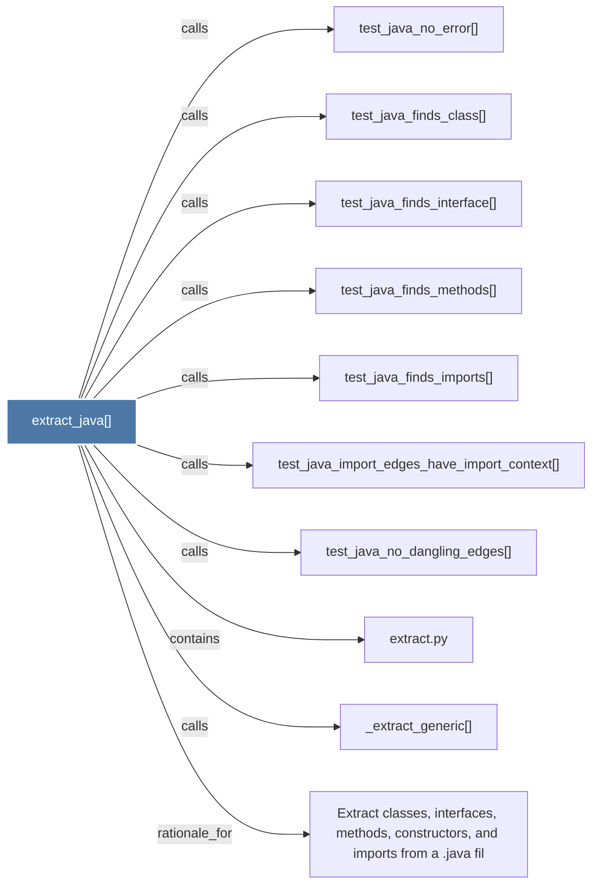

# extract_java()

> [!info] Properties
> **File Type**: code
> **Community**: [[_COMMUNITY_Community None|Community None]]
> **Degree**: 10

## Architecture Graph


## Outbound Connections
- [[Extract classes, interfaces, methods, constructors, and imports from a .java fil]] - `rationale_for` [EXTRACTED]
- [[_extract_generic()]] - `calls` [EXTRACTED]
- [[extract.py]] - `contains` [EXTRACTED]
- [[test_java_finds_class()]] - `calls` [INFERRED]
- [[test_java_finds_imports()]] - `calls` [INFERRED]
- [[test_java_finds_interface()]] - `calls` [INFERRED]
- [[test_java_finds_methods()]] - `calls` [INFERRED]
- [[test_java_import_edges_have_import_context()]] - `calls` [INFERRED]
- [[test_java_no_dangling_edges()]] - `calls` [INFERRED]
- [[test_java_no_error()]] - `calls` [INFERRED]

## Inbound Dependencies
> [!abstract]- Files that link here
```dataview
LIST
FROM [[extract_java()]]
```

#graphify/code #graphify/INFERRED #community/Community_None