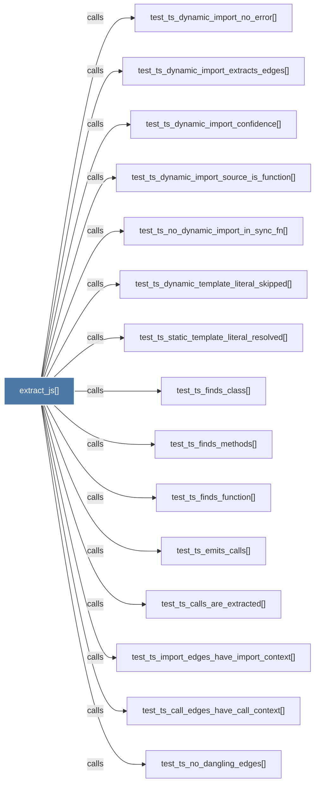

# extract_js()

> [!info] Properties
> **File Type**: code
> **Community**: [[_COMMUNITY_Community None|Community None]]
> **Degree**: 18

## Architecture Graph


## Outbound Connections
- [[Extract classes, functions, arrow functions, and imports from a .js.ts.tsx fil]] - `rationale_for` [EXTRACTED]
- [[_extract_generic()]] - `calls` [EXTRACTED]
- [[extract.py]] - `contains` [EXTRACTED]
- [[test_ts_call_edges_have_call_context()]] - `calls` [INFERRED]
- [[test_ts_calls_are_extracted()]] - `calls` [INFERRED]
- [[test_ts_dynamic_import_confidence()]] - `calls` [INFERRED]
- [[test_ts_dynamic_import_extracts_edges()]] - `calls` [INFERRED]
- [[test_ts_dynamic_import_no_error()]] - `calls` [INFERRED]
- [[test_ts_dynamic_import_source_is_function()]] - `calls` [INFERRED]
- [[test_ts_dynamic_template_literal_skipped()]] - `calls` [INFERRED]
- [[test_ts_emits_calls()]] - `calls` [INFERRED]
- [[test_ts_finds_class()]] - `calls` [INFERRED]
- [[test_ts_finds_function()]] - `calls` [INFERRED]
- [[test_ts_finds_methods()]] - `calls` [INFERRED]
- [[test_ts_import_edges_have_import_context()]] - `calls` [INFERRED]
- [[test_ts_no_dangling_edges()]] - `calls` [INFERRED]
- [[test_ts_no_dynamic_import_in_sync_fn()]] - `calls` [INFERRED]
- [[test_ts_static_template_literal_resolved()]] - `calls` [INFERRED]

## Inbound Dependencies
> [!abstract]- Files that link here
```dataview
LIST
FROM [[extract_js()]]
```

#graphify/code #graphify/INFERRED #community/Community_None