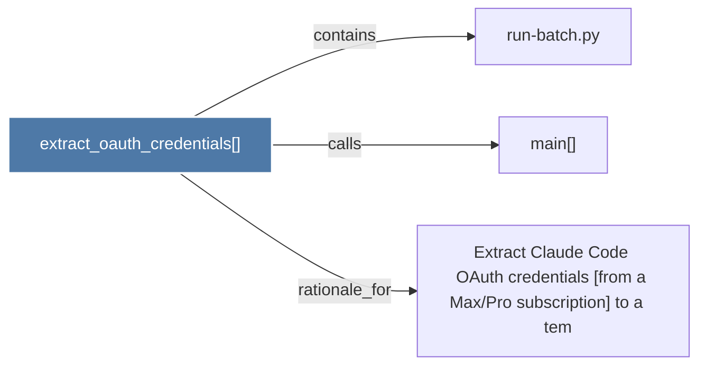

# extract_oauth_credentials()

> [!info] Properties
> **File Type**: code
> **Community**: [[_COMMUNITY_Community None|Community None]]
> **Degree**: 3

## Architecture Graph


## Outbound Connections
- [[Extract Claude Code OAuth credentials (from a MaxPro subscription) to a     tem]] - `rationale_for` [EXTRACTED]
- [[main()_27]] - `calls` [EXTRACTED]
- [[run-batch.py]] - `contains` [EXTRACTED]

## Inbound Dependencies
> [!abstract]- Files that link here
```dataview
LIST
FROM [[extract_oauth_credentials()]]
```

#graphify/code #graphify/EXTRACTED #community/Community_None