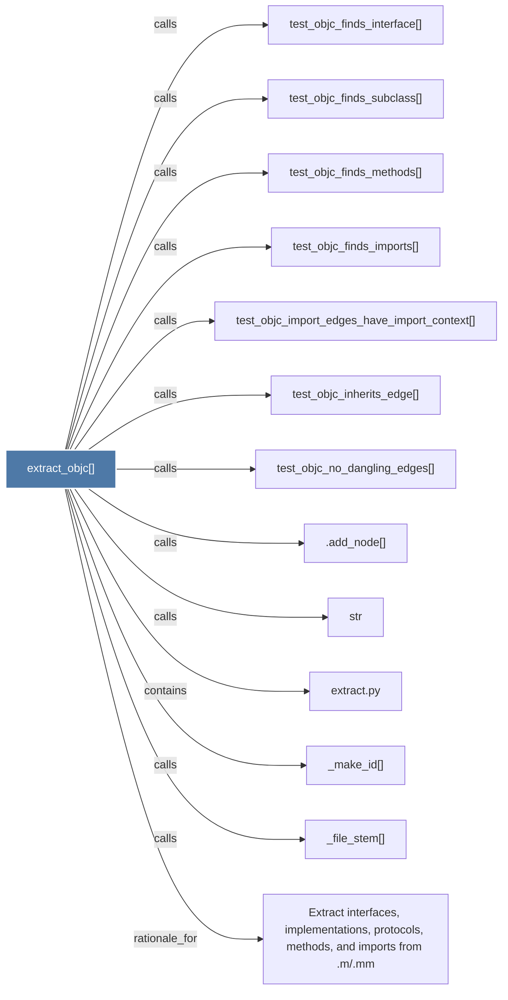

# extract_objc()

> [!info] Properties
> **File Type**: code
> **Community**: [[_COMMUNITY_Community None|Community None]]
> **Degree**: 13

## Architecture Graph


## Outbound Connections
- [[.add_node()]] - `calls` [INFERRED]
- [[Extract interfaces, implementations, protocols, methods, and imports from .m.mm]] - `rationale_for` [EXTRACTED]
- [[_file_stem()]] - `calls` [EXTRACTED]
- [[_make_id()]] - `calls` [EXTRACTED]
- [[extract.py]] - `contains` [EXTRACTED]
- [[str]] - `calls` [INFERRED]
- [[test_objc_finds_imports()]] - `calls` [INFERRED]
- [[test_objc_finds_interface()]] - `calls` [INFERRED]
- [[test_objc_finds_methods()]] - `calls` [INFERRED]
- [[test_objc_finds_subclass()]] - `calls` [INFERRED]
- [[test_objc_import_edges_have_import_context()]] - `calls` [INFERRED]
- [[test_objc_inherits_edge()]] - `calls` [INFERRED]
- [[test_objc_no_dangling_edges()]] - `calls` [INFERRED]

## Inbound Dependencies
> [!abstract]- Files that link here
```dataview
LIST
FROM [[extract_objc()]]
```

#graphify/code #graphify/INFERRED #community/Community_None