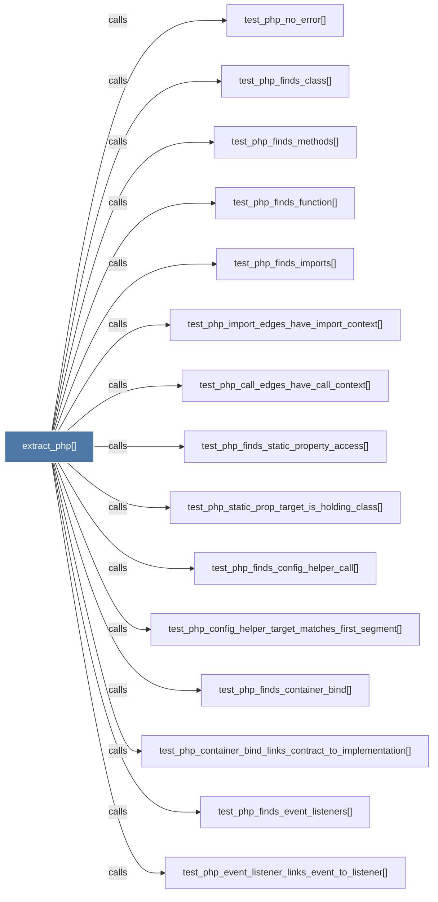

# extract_php()

> [!info] Properties
> **File Type**: code
> **Community**: [[_COMMUNITY_Community None|Community None]]
> **Degree**: 18

## Architecture Graph


## Outbound Connections
- [[Extract classes, functions, methods, namespace uses, and calls from a .php file.]] - `rationale_for` [EXTRACTED]
- [[_extract_generic()]] - `calls` [EXTRACTED]
- [[extract.py]] - `contains` [EXTRACTED]
- [[test_php_call_edges_have_call_context()]] - `calls` [INFERRED]
- [[test_php_config_helper_target_matches_first_segment()]] - `calls` [INFERRED]
- [[test_php_container_bind_links_contract_to_implementation()]] - `calls` [INFERRED]
- [[test_php_event_listener_links_event_to_listener()]] - `calls` [INFERRED]
- [[test_php_finds_class()]] - `calls` [INFERRED]
- [[test_php_finds_config_helper_call()]] - `calls` [INFERRED]
- [[test_php_finds_container_bind()]] - `calls` [INFERRED]
- [[test_php_finds_event_listeners()]] - `calls` [INFERRED]
- [[test_php_finds_function()]] - `calls` [INFERRED]
- [[test_php_finds_imports()]] - `calls` [INFERRED]
- [[test_php_finds_methods()]] - `calls` [INFERRED]
- [[test_php_finds_static_property_access()]] - `calls` [INFERRED]
- [[test_php_import_edges_have_import_context()]] - `calls` [INFERRED]
- [[test_php_no_error()]] - `calls` [INFERRED]
- [[test_php_static_prop_target_is_holding_class()]] - `calls` [INFERRED]

## Inbound Dependencies
> [!abstract]- Files that link here
```dataview
LIST
FROM [[extract_php()]]
```

#graphify/code #graphify/INFERRED #community/Community_None